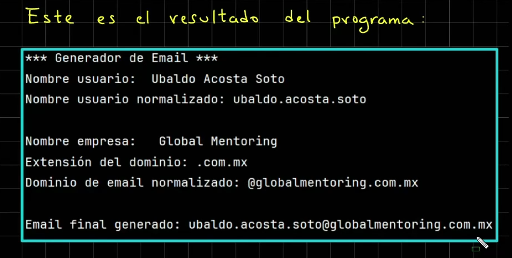

# Caracteres Especiales en java

## Índice

- [Volver al Índice Principal](index.md)
---
- [saltos de linea, tabulador, comillas, etc](#saltos-de-linea,-tabulador,-comillas,-etc)
- [Ejercicio para la creacion de emails](#ejercicio-para-la-creacion-de-emails)


Caracteres Especiales en java
### saltos de linea, tabulador, comillas, etc

```java
public class CaracteresEspeciales {
    public static void main(String[] args) {
        // Caracteres Especiales
        // '\n' - imprimir un salto de linea
        var cadena1 = "Hola\nMundo";
        System.out.println("cadena1 = " + cadena1);

        // '\t' - tabulador
        var cadena2 = "\tHola\tMundo";
        System.out.println("cadena2 = " + cadena2);

        // '\'' - agrega una comilla simple
        var cadena3 = "Hola \' Mundo";
        System.out.println("cadena3 = " + cadena3);

        // '\"' - agrega una comilla doble
        var cadena4 = "Hola \" Mundo";
        System.out.println("cadena4 = " + cadena4);

        // '\\' - caracter de diagonal invertida
        var cadena5 = "Hola \\ Mundo";
        System.out.println("cadena5 = " + cadena5);

    }
}
```

### Ejercicio para la creacion de emails




**SOLUCION AL EJERCICIO**

```java
public class GeneradorEmails {
    public static void main(String[] args) {
        System.out.println("*** Generador de emails ***");
        //Nombre completo del usuario
        var nombreCompleto="Angel Granados Perez";
        System.out.println("nombreCompleto = " + nombreCompleto);

        //Procesar o normalizar el nombre del usuario
        //Limpiar los espacios en blanco al inicio y al final
        var nombreNormalizado=nombreCompleto.strip();
        //Reemplazamos los espacios en blancos por puntos
        nombreNormalizado=nombreNormalizado.replace(" ",".");
        //Convertimos a minusculas el nombre
        nombreNormalizado=nombreNormalizado.toLowerCase();

        //Datos de la empresa
        var nombreEmpresa="Global Mentoriong";
        System.out.println("\nNombre empresa: "+ nombreEmpresa);
        var extensionDominio=".com.mx";

        //Quitamos los espacios en blanco y convertimos a minisculas
        var nombreEmpresaNormalizado=nombreEmpresa.strip().replace(" ",".").toLowerCase();
        var dominioEmailNormalizado="@"+ nombreEmpresaNormalizado + extensionDominio;
        System.out.println("dominioEmailNormalizado = " + dominioEmailNormalizado);
        
        //Creamos el email final
        var emailNormalizado=nombreNormalizado+dominioEmailNormalizado;
        System.out.println("emailNormalizado = " + emailNormalizado);

    }
}
```