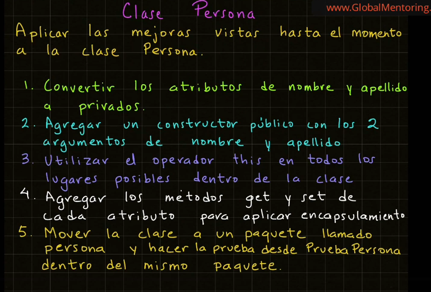

# Encapsulamiento

## Índice
- [Volver al Índice Principal](index.md)
---
- [Ejemplo de encapusulamiento](#ejemplo-de-encapsulamiento)
- [Reto encapulamiento de clase Persona](#reto-encapulamiento-clase-persona)


### Ejemplo de encapsulamiento
**Clase Aritmetica.java**
 ```java
package aritmetica;

public class Aritmetica {
    private int operando1;
    private int operando2;

    // Constructor vacio
    public Aritmetica(){
    }

    public Aritmetica(int operando1, int operando2){
        this.operando1 = operando1;
        this.operando2 = operando2;
    }

    public void sumar(){
        var resultado = this.operando1 + this.operando2;
        System.out.println("Resultado Suma: " + resultado);
    }

    public void restar(){
        var resultado = this.operando1 - this.operando2;
        System.out.println("Resultado Resta: " + resultado);
    }

    public int getOperando1(){
        return this.operando1;
    }

    public void setOperando1(int operando1){
        this.operando1 = operando1;
    }

    public int getOperando2(){
        return this.operando2;
    }

    public void setOperando2(int operando2){
        this.operando2 = operando2;
    }

}
```
**Clase PruebaAritmetica.java**
```java
package prueba;

import aritmetica.Aritmetica;

public class PruebaAritmetica {
    public static void main(String[] args) {
        System.out.println("*** Ejemplo Aritmetica ***");
        var aritmetica1 = new Aritmetica(5, 7);
        System.out.println("Atributo operando1: " + aritmetica1.getOperando1());
        aritmetica1.setOperando1(10);
        aritmetica1.setOperando2(15);
        aritmetica1.sumar();
        aritmetica1.restar();
        // Creamos un segundo objeto
        System.out.println();
        var aritmetica2 = new Aritmetica(12, 16);
        aritmetica2.sumar();
    }
}
```

### Reto Encapulamiento Clase Persona


**Clase Persona.java**
```java
package persona;

public class Persona {
    private String nombre;
    private String apellido;

    public Persona(String nombre, String apellido){
        this.nombre = nombre;
        this.apellido = apellido;
    }

    void mostrarPersona(){
        System.out.println("Nombre: " + this.nombre);
        System.out.println("Apellido: " + this.apellido);
    }

    public String getNombre() {
        return this.nombre;
    }

    public void setNombre(String nombre) {
        this.nombre = nombre;
    }

    public String getApellido() {
        return this.apellido;
    }

    public void setApellido(String apellido) {
        this.apellido = apellido;
    }
}
```
**Clase PruebaPersona.java**
```java
package persona;

public class PruebaPersona {
    public static void main(String[] args) {
        System.out.println("*** Creacion de Clase y Objetos Persona ***");
        var objeto1 = new Persona("Layla", "Acosta");
        objeto1.mostrarPersona();
        // Segundo objeto
        System.out.println();
        var objeto2 = new Persona("Ian", "Gomez");
        objeto2.mostrarPersona();
    }

}
```


