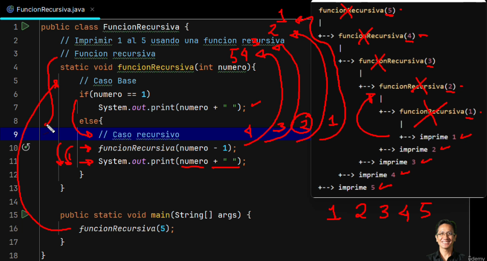

# FUNCIONES

## Índice

- [Volver al Índice Principal](index.md)
---
- [Ejemplo de Funcion sumar](#ejemplo-de-funcion-sumar)
- [Ejemplo de funcion esPar](#ejemplo-de-funcion-espar)
- [Ejemplo de funcion Recursiva](#ejemplo-de-funcion-recursiva)


FUNCIONES

### Ejemplo de Funcion sumar

```java
public class FuncionSumar {
    // Definimos la funcion sumar
    static int sumar(int a, int b){
        var resultado = a + b;
        return resultado;
    }

    public static void main(String[] args) {
        int arg1 = 3, arg2 = 8;
        var resultado_funcion = sumar(arg1, arg2);
        System.out.println("resultado_funcion = " + resultado_funcion);
        resultado_funcion = sumar(10, 20);
        System.out.println("resultado_funcion = " + resultado_funcion);
    }
}
```

### Ejemplo de funcion esPar

```java
import java.util.Scanner;

public class FuncionPar {
    // Funcion para saber si un numero es par
    static boolean esPar(int numero){
//        if(numero % 2 == 0)
//            return true;
//        else
//            return false;
        return (numero % 2 == 0) ? true : false;
    }

    public static void main(String[] args) {
        System.out.print("Proporciona un valor numérico: ");
        var numero = Integer.parseInt(new Scanner(System.in).nextLine());
        System.out.println("Número par? " + esPar(numero));
    }
}
```


### Ejemplo de funcion Recursiva

```java
public class FuncionRecursiva {
    // Imprimir 1 al 5 usando una funcion recursiva
    // Funcion recursiva
    static void funcionRecursiva(int numero){
        // Caso Base
        if(numero == 1)
            System.out.print(numero + " ");
        else{
            // Caso recursivo
            funcionRecursiva(numero - 1);
            System.out.print(numero + " ");
        }
    }

    public static void main(String[] args) {
        funcionRecursiva(10);
    }
}
```


