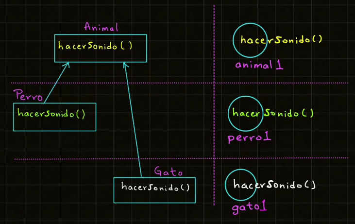

# Polimorfismo
## Índice
- [Volver al Índice Principal](index.md)
---
- [Explicacion de polimorfismo](#explicacion-de-polimorfismo)
- [Ejemplo de polimorfismo](#ejemplo-de-polimorfismo)

### Explicacion de polimorfismo
**Polimorfismo significa varias formas.**


### Ejemplo de polimorfismo
```java
package animales;

public class Animal {
  protected void hacerSonido(){
      System.out.println("El animal hace un sonido");
  }
}

class Perro extends Animal{
    @Override
    protected void hacerSonido(){
        System.out.println("El perro hace wauf");
    }
}

class Gato extends Animal{
    @Override
    protected void hacerSonido(){
        System.out.println("El gato hace miau");
    }

}

class PruebaAnimal{

    // Metodo polimorfico
    static void imprimirSonido(Animal animal){
        animal.hacerSonido();
    }

    public static void main(String[] args) {
        // Objeto de la clase Padre (Animal)
        //var animal = new Animal();
        //var animal = new Perro();
        var animal = new Gato();
        imprimirSonido(animal);
    }
}
```
