# Cuaderno de estudio Java

## INTRODUCCION A JAVA

### Hola mundo en java
Sintaxis para mostrar un hola mundo en JAVA

```java
public class HolaMundo {
    //Agregamos el metodo principal
    public static void main(String[] args) {
        System.out.println("hola mundo perros");
    }
}
```
Ejercicio presentarse en java

```java
public class Presentate {
    public static void main(String[] args) {
        System.out.println("Angel G");
        System.out.println("27 años");
        System.out.println("mexico");
    }
}

```
***

## Variables

### Ejercicio de reserva de hoteles

```java
import java.sql.SQLOutput;

public class ReservaHoteles {
    public static void main(String[] args) {
        /*
        Sistema de reserva de Hoteles

        Captura el detalle de la reservacion de hoteles.

        El detalle que se debe de capturar es:
        - Nombre del cliente
        - Dias de estancia
        - Tarifa diaria
        - Indicar si la habitacion cuenta con vista al mar

        Debe asignar valores iniciales y mandar a imprimir el valor de cada variable.
        Por ultimo se les pide modificar algunos valores de la reservacion y mandar a imprimr nuevamente cada
        variable para observar los cambios
        * */

        System.out.println("*** Reserva de hoteles ***");

        //Definimos variables
        var nombreCliente="Miguel flores";
        var diasEstancia=7;
        var tarifaDiaria=1300;
        var tienesVistaMar=true;

        //Mostramos el detalle de la reserva con soutv (con esto imprimimos las variables)
        System.out.println("nombreCliente = " + nombreCliente);
        System.out.println("diasEstancia = " + diasEstancia);
        System.out.println("tarifaDiaria = " + tarifaDiaria);
        System.out.println("tienesVistaMar = " + tienesVistaMar);

        //Modificando valores
        diasEstancia=4;
        tarifaDiaria=1111;
        tienesVistaMar=false;

        //Nuevos datos de la reservacion
        System.out.println("Nuevos datos de la reservacion");
        System.out.println("nombreCliente = " + nombreCliente);
        System.out.println("diasEstancia = " + diasEstancia);
        System.out.println("tarifaDiaria = " + tarifaDiaria);
        System.out.println("tienesVistaMar = " + tienesVistaMar);
    }
}
```

***
## Cadenas

### Manejo de cadenas en JAVA
```java
public class Cadenas {
    public static void main(String[] args) {
        System.out.println("*** Manejo de Cadenas en Java ***");
        var cadena1 = "Hola";
        System.out.println("cadena1 = " + cadena1);
        var cadena2 = new String("Mundo");
        System.out.println("cadena2 = " + cadena2);
        var cadena3 = cadena1 + " " + cadena2;
        System.out.println("cadena3 = " + cadena3);
        // Cadena multiples lineas (text block)       
        var cadena4 = """
                Este es un texto
                multilinea
                mas 
                lineas
                """;
        System.out.println("cadena4 = " + cadena4);
    }
}
```

### Ejemplo de comparacion de cadenas

```java
public class ComparacionCadenas {
    public static void main(String[] args) {
        // Comparacion de Cadenas (pool de cadenas)
        var cadena1 = "Java";
        var cadena2 = "Java";
        var cadena3 = new String("Java");

        // Comparacion de cadenas (==) comparan la referencia
        System.out.print("cadena1 es igual en referencia a cadena2: ");
        System.out.println(cadena1 == cadena2);
        // Comparamos cadena1 con cadena3 (referencias)
        System.out.print("cadena1 es igual en referencia a cadena3: ");
        System.out.println(cadena1 == cadena3);

        // Comparar contenido usaremos el metodo equals
        System.out.print("cadena1 es igual en contenido a cadena3: ");
        System.out.println(cadena1.equals(cadena3));

    }
}

```

### Ejemplo de manejo de indices en una cadena 
```java
public class IndicesCadena {
    public static void main(String[] args) {
        // Manejo de índices en una cadena
        var cadena1 = "Hola Mundo";
        // Recuperar el primer caracter
        var primerCaracter = cadena1.charAt(0); // Recuperar el caracter 'H'
        System.out.println("primerCaracter = " + primerCaracter);
        // Recuperar el último caracter (en la posicion 9)
        var ultimoCaracter = cadena1.charAt(9);
        System.out.println("ultimoCaracter = " + ultimoCaracter);
        // imprimir la leta M, indice 5
        var letraM = cadena1.charAt(5);
        System.out.println("letraM = " + letraM);
    }
}
```
### Inmutabilidad de cadenas

```java
public class InmutabilidadCadenas {
    public static void main(String[] args) {
        //Inmutabilidad de Cadenas
        var cadena1="hola";
        System.out.println("cadena1 = " + cadena1);
        //Si no queremos perder la referencia del objeto anterior,
        //creamos una cadena2 que almacenara la referencia de cadena1
        var cadena2=cadena1;
        cadena1="adios";
        System.out.println("cadena1 modificado = " + cadena1);
        System.out.println("cadena2 = " + cadena2);
    }
}
```

### Metodos de cadenas
```java
public class MetodosDeCadenas {
    public static void main(String[] args) {
        // Metodo de cadenas
        var cadena1 = "Hola Mundo";

        // Obtener el largo de una cadena
        var longitud = cadena1.length();
        System.out.println("longitud = " + longitud);

        // Reemplazar caracteres
        var nuevaCadena = cadena1.replace('o','a');
        System.out.println("nuevaCadena = " + nuevaCadena);

        // Convertir a mayusculas
        var mayusculas = cadena1.toUpperCase();
        System.out.println("mayusculas = " + mayusculas);

        // Convertir a minusculas
        System.out.println("minusculas = " + cadena1.toLowerCase());

        // Eliminar espacios al inicio y al final
        var cadena2 = " Leo Reyes    ";
        System.out.println("cadena2 con espacios = " + cadena2);
        System.out.println("cadena2 sin espacios = " + cadena2.trim());

    }
}
```

### Manejo de subcadenas en JAVA

```java
public class ManejoSubcadenas {
    public static void main(String[] args) {
        // Tema de subcadenas
        // substring(inicio, fin (sin incluirlo))
        var cadena1 = "Hola Mundo";
        System.out.println("cadena1 = " + cadena1);

        // Subcadena
        var subcadena1 = cadena1.substring(0, 4);
        System.out.println("subcadena1 = " + subcadena1);

        //var subcadena2 = cadena1.substring(5);
        var subcadena2 = cadena1.substring(5, 10);
        System.out.println("subcadena2 = " + subcadena2);

    }
}
```

### Busqueda de subcadenas

```java
public class BusquedaSubcadenas {
    public static void main(String[] args) {
        // Buscar subcadenas
        // indexOf - Devuelve el indice de la primera aparicion de la subcadena
        var cadena1 = "Hola Mundo";
        // subcadena a buscar "Hola"
        var indice1 = cadena1.indexOf("Hola");
        System.out.println("indice1 = " + indice1);
        // lastIndexOf - devuelve el indice de la ultima aparicion de la subcadena
        // subcadena de Mundo
        var indice2 = cadena1.lastIndexOf("Mundo");
        System.out.println("indice2 = " + indice2);
        // subcadena no encontrada devuelve -1
        var indice3 = cadena1.lastIndexOf("Java");
        System.out.println("indice3 = " + indice3);
    }
}
```

### Reemplazar subcadenas

```java
public class ReemplazarSubcadenas {
    public static void main(String[] args) {
        // Reemplazar subcadenas
        var cadena = "Hola Mundo";
        System.out.println("cadena original = " + cadena);

        // Reemplazar "Mundo" por "a todos"
        var nuevaCadena = cadena.replace("Mundo", "a todos");
        System.out.println("nuevaCadena = " + nuevaCadena);

        // Reemplazar "Hola" por "Adios"
        nuevaCadena = cadena.replace("Hola", "Saludos");
        System.out.println("nuevaCadena = " + nuevaCadena);
    }
}

```

### Mas formas de concatenar cadenas

```java
public class MasConcatenacionCadenas {
    public static void main(String[] args) {
        //Mas formas de concatenar cadenas en java
        var cadena1="hola";
        var cadena2="mundo";
        var cadena3= cadena1 + " " + cadena2;
        System.out.println("cadena3 = " + cadena3);

        //Metodo concat
        cadena3=cadena1.concat(" ").concat("Tonotos");
        System.out.println("cadena3 usando concat = " + cadena3);

        //StringBuilder
        var constructorCadenas= new StringBuilder();
        constructorCadenas.append(cadena1);
        constructorCadenas.append(" ");
        constructorCadenas.append(cadena2);
        var resultado=constructorCadenas.toString();
        System.out.println("resultado = " + resultado);

        //StringBuffer
        var stringBuffer= new StringBuffer();
        stringBuffer.append(cadena1).append(" ").append(cadena2);
        resultado=stringBuffer.toString();
        System.out.println("resultado stringbuffer= " + resultado);

        //join
        resultado=String.join(" ", cadena1, cadena2, "tonotos");
        System.out.println("resultado join= " + resultado);
    }
}
```
## Caracteres Especiales en java
### saltos de linea, tabulador, comillas, etc

```java
public class CaracteresEspeciales {
    public static void main(String[] args) {
        // Caracteres Especiales
        // '\n' - imprimir un salto de linea
        var cadena1 = "Hola\nMundo";
        System.out.println("cadena1 = " + cadena1);

        // '\t' - tabulador
        var cadena2 = "\tHola\tMundo";
        System.out.println("cadena2 = " + cadena2);

        // '\'' - agrega una comilla simple
        var cadena3 = "Hola \' Mundo";
        System.out.println("cadena3 = " + cadena3);

        // '\"' - agrega una comilla doble
        var cadena4 = "Hola \" Mundo";
        System.out.println("cadena4 = " + cadena4);

        // '\\' - caracter de diagonal invertida
        var cadena5 = "Hola \\ Mundo";
        System.out.println("cadena5 = " + cadena5);

    }
}
```

### Ejercicio para la creacion de emails


**SOLUCION AL EJERCICIO**

```java
public class GeneradorEmails {
    public static void main(String[] args) {
        System.out.println("*** Generador de emails ***");
        //Nombre completo del usuario
        var nombreCompleto="Angel Granados Perez";
        System.out.println("nombreCompleto = " + nombreCompleto);

        //Procesar o normalizar el nombre del usuario
        //Limpiar los espacios en blanco al inicio y al final
        var nombreNormalizado=nombreCompleto.strip();
        //Reemplazamos los espacios en blancos por puntos
        nombreNormalizado=nombreNormalizado.replace(" ",".");
        //Convertimos a minusculas el nombre
        nombreNormalizado=nombreNormalizado.toLowerCase();

        //Datos de la empresa
        var nombreEmpresa="Global Mentoriong";
        System.out.println("\nNombre empresa: "+ nombreEmpresa);
        var extensionDominio=".com.mx";

        //Quitamos los espacios en blanco y convertimos a minisculas
        var nombreEmpresaNormalizado=nombreEmpresa.strip().replace(" ",".").toLowerCase();
        var dominioEmailNormalizado="@"+ nombreEmpresaNormalizado + extensionDominio;
        System.out.println("dominioEmailNormalizado = " + dominioEmailNormalizado);
        
        //Creamos el email final
        var emailNormalizado=nombreNormalizado+dominioEmailNormalizado;
        System.out.println("emailNormalizado = " + emailNormalizado);

    }
}
```

## Scanner

### Manejo por consola

```java
import java.util.Scanner;

public class ManejoConsola {
    public static void main(String[] args) {
        //Introducir valores por consila
        var consola=new Scanner(System.in);
        System.out.println("escribe tu nombre");
        var nombre=consola.nextLine();
        System.out.print("nombre = " + nombre);
    }
}

```

### Leer diferentes tipos de datos
```java
import java.util.Scanner;

public class LeerTiposDatos {
    public static void main(String[] args) {
        // Leer distintos tipos de datos

        // Leer un tipo int
        var consola = new Scanner(System.in);
        System.out.print("Ingresa tu edad: ");
        var edad = consola.nextInt();
        System.out.println("edad = " + edad);

        // Leer un tipo double
        System.out.print("Ingresa tu altura: ");
        var altura = consola.nextDouble();
        System.out.println("altura = " + altura);
        // Consumimos el caracter de salto de linea
        consola.nextLine();

        /*
        Los metodos nextDouble y nextLine no consumen el caracter de salto de linea
        tenemos que consumirlos directamente nosotros antes de consumir el metodo
        nextLine(), NO ES RECOMENDABLE USARLOS  (ARRIBA)
         */


        // Leer un tipo String
        System.out.print("Ingresa tu nombre: ");
        var nombre = consola.nextLine();   //REGESA UNA CADENA
        System.out.println("nombre = " + nombre);

        // Conversion de datos
        System.out.print("Proporciona un valor entero: ");
        /*
         var enteroString = consola.nextLine();
         var entero = Integer.parseInt(enteroString);
        */
        var entero = Integer.parseInt(consola.nextLine());
        System.out.println("entero = " + entero);
        // Tipo flotante
        System.out.print("Proporciona un valor flotante: ");
        var flotante = Float.parseFloat(consola.nextLine());
        System.out.println("flotante = " + flotante);
        //Double.parseDouble()
        //Boolean.parseBoolean()
    }
}
```


### Ejercicio: Sistema de Empleados 


**SOLUCION AL EJERCICIO**

```java
package Java.ManejoConsola.src;

import java.util.Scanner;

public class SistemaEmpleados {
    public static void main(String[] args) {
        System.out.println("*** Sistema de empleados ***");

        var consola=new Scanner(System.in);

        //Nombre del empleado
        System.out.print("Nombre del empleado:  ");
        var nombreEmpleado=consola.nextLine();

        //Edad del empleado
        System.out.print("Edad del empleado: ");
        var edadEmpleado=Integer.parseInt(consola.nextLine());

        //Salario empleado
        System.out.print("Salario empleado: ");
        var salarioEmpleado=Double.parseDouble(consola.nextLine());

        //Es jefe de departamento
        System.out.print("Es jefe de departamenro (true/false)? ");
        var esJefeDepartamento= Boolean.parseBoolean(consola.nextLine());

        //Imprimir los valores del Empleado

        System.out.println("\nDatos del empleado: ");
        System.out.println("\tnombre: "+ nombreEmpleado);
        System.out.println("\tedad: "+edadEmpleado + "Años" );
        System.out.println("\tSalario: $%.2f".formatted(salarioEmpleado));
        System.out.println("\tEs jefe de departamento? "+ esJefeDepartamento);

    }
}
```
***
### Ejercicio: Reto - Proyecto Recetas de Cocina

__Resultado del ejercicio__


**SOLUCION AL EJERCICIO**
```java
import java.util.Scanner;

public class RecetasCocina {
    public static void main(String[] args) {
        System.out.println("*** Recetas de Cocina ***");
        var consola = new Scanner(System.in);

        // Nombre de la receta
        System.out.print("Ingresa el nombre de la receta: ");
        var nombreReceta = consola.nextLine();

        // Ingredientes
        System.out.print("Ingresa los ingredientes: ");
        var ingredientes = consola.nextLine();

        // Tiempo de preparación
        System.out.print("Ingresa el tiempo de preparación (min): ");
        var tiempoPreparacion = Integer.parseInt(consola.nextLine());

        // Dificultad de la preperación
        System.out.print("Ingresa la dificultad (Fácil/Medio/Dificil): ");
        var dificultadPreperacion = consola.nextLine();

        // Imprimir los valores de la receta
        System.out.println("\n--- Receta de Cocina ---");
        System.out.println("\tNombre receta: " + nombreReceta);
        System.out.println("\tIngredientes: " + ingredientes);
        System.out.println("\tTiempo de preparación: " + tiempoPreparacion + " minutos");
        System.out.println("\tDificultad: " + dificultadPreperacion);
    }
}

```

***
### Números Aleatorios (Random)

```java
package Java.ManejoConsola.src;

import java.util.Random;

public class NumerosAleatorios {
    public static void main(String[] args) {
        System.out.println("*** Números Aleatorios ***");
        var random = new Random();

        // Generar un numero aleatorio entre 0 y 9
        var numeroAleatorio = random.nextInt(10);
        System.out.println("numeroAleatorio entre 0 y 9 = " + numeroAleatorio);

        // Generar un numero aleatorio entre 1 y 10
        numeroAleatorio = random.nextInt(10) + 1;
        System.out.println("numeroAleatorio entre 1 y 10 = " + numeroAleatorio);

        // Generar un numero flotante entre 0.0 y 1.0
        var flotanteAleatorio = random.nextFloat();
        System.out.println("flotanteAleatorio = " + flotanteAleatorio);

        // Simular el lanzamiento de un dado (1 y 6)
        var dado = random.nextInt(6) + 1;
        System.out.println("Resultado de lanzar el dado = " + dado);
    }
}

```

### Formateo de Cadenas

```java
package Java.ManejoConsola.src;

public class FormateoCadenas {
    public static void main(String[] args) {
        System.out.println("*** Formateo de Cadenas ***");
        var nombre = "Matías";
        var edad = 35;
        var salario = 21000.50;

        // String.format
        var mensaje = String.format("Nombre: %s, Edad: %d, Salario: $%.2f",nombre, edad, salario);
        System.out.println(mensaje);

        // Metodo printf
        System.out.printf("Nombre: %s, Edad: %d, Salario: $%.2f%n", nombre, edad, salario);


        var numeroEmpleado = 12;
        // Formateo con text block
        mensaje = """
                %nDetalle Persona:\s
                -----------------
                \tNombre: %s
                \tNo. Empleado: %04d
                \tEdad: %d años
                \tSalario: $%.2f
                """.formatted(nombre, numeroEmpleado, edad, salario);
        System.out.println(mensaje);

        // Formateo con tex block y printf directamente
        System.out.printf("""
                %nDetalle Persona:\s
                -----------------
                \tNombre: %s
                \tNo. Empleado: %04d
                \tEdad: %d años
                \tSalario: $%.2f
                """, nombre, numeroEmpleado, edad, salario);
    }
}

```

### Ejercicio: Reto - Generador de ID unicor
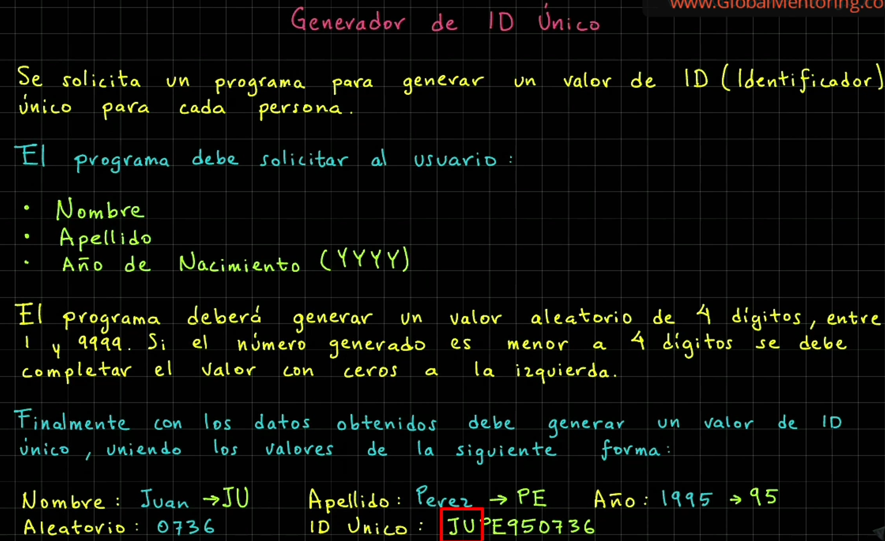
__Resultado del ejercicio__
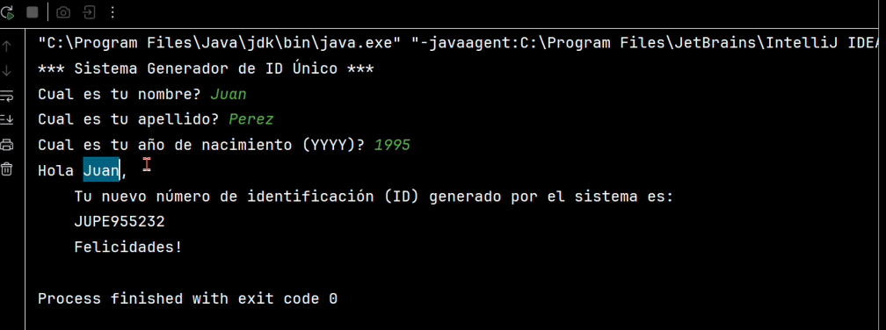

**SOLUCION AL EJERCICIO**
```java
import java.util.Random;
import java.util.Scanner;

public class GeneradorIdUnico {
    public static void main(String[] args) {
        System.out.println("*** Sistema Generador de ID Único ***");
        var consola = new Scanner(System.in);
        var aleatorio = new Random();

        // Solicitamos nombre de usuario
        System.out.print("Cual es tu nombre? ");
        var nombre = consola.nextLine();

        // Solicitamos el apellido
        System.out.print("Cual es tu apellido? ");
        var apellido = consola.nextLine();

        // Solicitamos el año de nacimiento
        System.out.print("Cual es tu año de nacimiento (YYYY)? ");
        var anioNacimiento = consola.nextLine();

        // Normalizar los valores
        var nombre2 = nombre.trim().toUpperCase().substring(0, 2);
        var apellido2 = apellido.trim().toUpperCase().substring(0,2);
        var anioNacimiento2 = anioNacimiento.trim().substring(2);

        // Generar el valor aleatorio (1 y 9999)
        var numeroAleatorio = aleatorio.nextInt(9999) + 1;

        // Formato de 4 digitos
        var numeroAleatorioFormato = String.format("%04d", numeroAleatorio);

        // Generar el ID Único
        var idUnico = nombre2 + apellido2 + anioNacimiento2 + numeroAleatorioFormato;

        // Imprimir el ID unico
        System.out.printf("""
                %nHola %s,
                \tTu nuevo número de identificación (ID) generado por el sistema es:
                \t%s
                \t¡Felicidades!
                """, nombre, idUnico);
    }
}
```


### Ejercicio: Reto - Valor dentro de rango
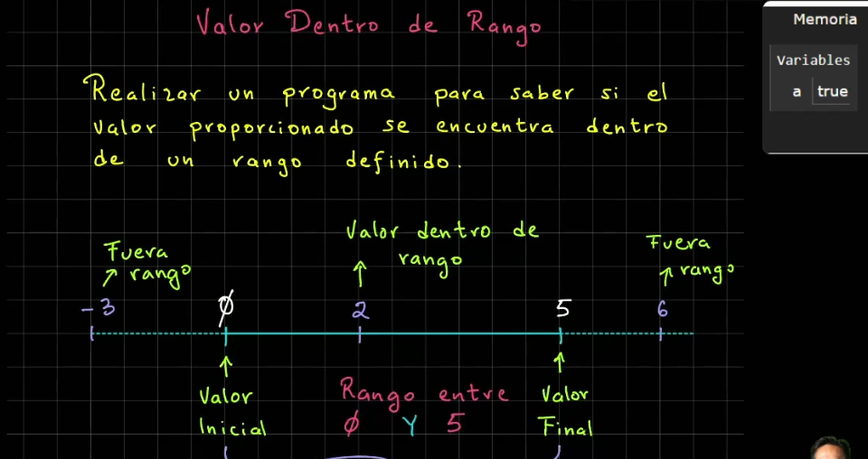

**SOLUCION AL EJERCICIO**
```java
import java.util.Scanner;

public class ValorDentroRango {
    public static void main(String[] args) {
        System.out.println("*** Valor Dentro Rango ***");
        // Definimos los limites
        final var MINIMO = 0;
        final var MAXIMO = 5;
        // Solicitar un valor entre 0 y 5
        System.out.print("Proporciona un dato entre 0 y 5: ");
        var dato = Integer.parseInt(new Scanner(System.in).nextLine());
        // Verificar si el dato esta dentro de rango
        var estaDentroRango = dato >= MINIMO && dato <= MAXIMO;
        System.out.println("estaDentroRango?  " + estaDentroRango);
    }
}
```


### Ejercicio: Reto - sistema descuento VIP
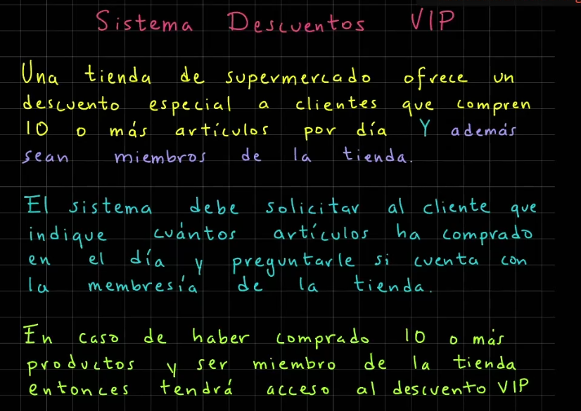

**SOLUCION AL EJERCICIO**
```java
import java.util.Scanner;

public class SistemaDescuentosVIP {
    public static void main(String[] args) {
        System.out.println("*** Sistema de Descuentos VIP*** ");
        final var NO_PRODUCTOS_DESCUENTO = 10;
        var consola = new Scanner(System.in);

        System.out.print("Cuántos productos compraste hoy? ");
        var cantidadProductos = Integer.parseInt(consola.nextLine());

        System.out.print("Tienes la membresía de la tienda (true/false)? ");
        var tienesMembresia = Boolean.parseBoolean(consola.nextLine());

        var esElegibleDescuento =
                cantidadProductos >= NO_PRODUCTOS_DESCUENTO && tienesMembresia;

        System.out.println("Tienes acceso al descuento VIP ? " + esElegibleDescuento);
    }
}
```

### Ejercicio: Reto - Sistema Prestamo Libros
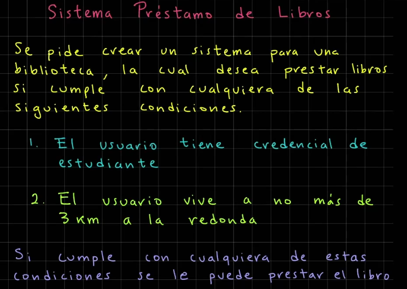

**SOLUCION AL EJERCICIO**
```java
import java.util.Scanner;

public class SistemaPrestamoLibros {
    public static void main(String[] args) {
        System.out.println("*** Sistema Prestamo Libros ***");

        final var DISTANCIA_PERMITIDA_KM = 3;
        var consola = new Scanner(System.in);

        System.out.print("Cuentas con credencial de estudiante (true/false)? ");
        var tienesCredencial = Boolean.parseBoolean(consola.nextLine());

        System.out.print("A cuanto km vives de la biblioteca? ");
        var distanciaBibliotecaKm = Integer.parseInt(consola.nextLine());

        var esElegiblePrestamo =
                tienesCredencial || distanciaBibliotecaKm <= DISTANCIA_PERMITIDA_KM;

        System.out.println("Eres elegible para prestamo de libros? " + esElegiblePrestamo);

    }
}
```


### Ejercicio: Reto - Generador ticket venta


**SOLUCION AL EJERCICIO**
```java
import java.util.Scanner;

public class TicketVenta {
    public static void main(String[] args) {
        System.out.println("*** Generación Ticket de Venta ***");
        var consola = new Scanner(System.in);

        System.out.print("Precio leche: ");
        var precioLeche = Double.parseDouble(consola.nextLine());

        System.out.print("Precio pan: ");
        var precioPan = Double.parseDouble(consola.nextLine());

        System.out.print("Precio lechuga: ");
        var precioLechuga = Double.parseDouble(consola.nextLine());

        System.out.print("Precio plátanos: ");
        var precioPlatanos = Double.parseDouble(consola.nextLine());

        // Cálculo del subtotal (sin impuestos)
        var subtotal = precioLeche + precioPan + precioLechuga + precioPlatanos;

        // Cálculo con impuestos (16%)
        var impuesto = subtotal * 0.16;

        // Cálculo total de la compra (con impuestos)
        var costoTotalCompra = subtotal + impuesto;

        // Imprimir el ticket de venta
        System.out.printf("""
                %nTicket de Venta
                ---------------
                Subtotal: $%.2f
                Impuesto (16%%): $%.2f
                Costo total de la compra: $%.2f
                """, subtotal, impuesto, costoTotalCompra);
    }
}
```

### MEJORA DEL EJERCICIO CON DESCUENTO
```java
import java.util.Scanner;

public class TicketVenta {
    public static void main(String[] args) {
        System.out.println("*** Generación Ticket de Venta ***");
        var consola = new Scanner(System.in);

        System.out.print("Precio leche: ");
        var precioLeche = Double.parseDouble(consola.nextLine());

        System.out.print("Precio pan: ");
        var precioPan = Double.parseDouble(consola.nextLine());

        System.out.print("Precio lechuga: ");
        var precioLechuga = Double.parseDouble(consola.nextLine());

        System.out.print("Precio plátanos: ");
        var precioPlatanos = Double.parseDouble(consola.nextLine());

        System.out.print("Aplicar algún descuento (%)? ");
        var descuentoPorcentaje = Integer.parseInt(consola.nextLine());

        // Cálculo del subtotal (sin impuestos)
        var subtotal = precioLeche + precioPan + precioLechuga + precioPlatanos;

        // Aplicar el descuento
        var descuento = subtotal * (descuentoPorcentaje/100.0);

        // Subtotal con descuento
        var subtotalConDescuento = subtotal - descuento;

        // Cálculo con impuestos (16%)
        var impuesto = subtotalConDescuento * 0.16;

        // Cálculo total de la compra (con impuestos)
        var costoTotalCompra = subtotalConDescuento + impuesto;

        // Imprimir el ticket de venta
        System.out.printf("""
                %nTicket de Venta
                ---------------
                Subtotal: $%.2f
                Descuento: $%.2f (%d%%)
                Impuesto (16%%): $%.2f
                Costo total de la compra: $%.2f
                """, subtotal, descuento, descuentoPorcentaje,
                impuesto, costoTotalCompra);
    }
}
```
### Ejercicio: Reto - Sistema de autentificacion de Usuarios


__Resultado del ejercicio__

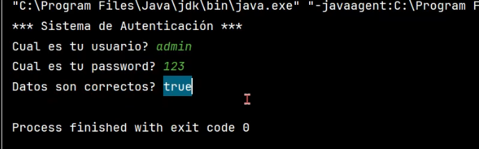

**SOLUCION AL EJERCICIO**
```java
import java.util.Scanner;

public class SistemaAutenticacion {
    public static void main(String[] args) {
        System.out.println("*** Sistema de Autenticación ***");

        final var USUARIO_VALIDO = "admin";
        final var PASSWORD_VALIDO = "123";

        var consola = new Scanner(System.in);

        System.out.print("Cuál es tu usuario? ");
        var usuarioIngresado = consola.nextLine();

        System.out.print("Cuál es tu password? ");
        var passwordIngresado = consola.nextLine();

        var sonDatosCorrectos = usuarioIngresado.equals(USUARIO_VALIDO)
                && passwordIngresado.equals(PASSWORD_VALIDO);

        System.out.println("Datos son correctos? " + sonDatosCorrectos);
    }
}
```

### Ejercicio: Reto - Calcular el area de un rectangulo


**SOLUCION AL EJERCICIO**
```java
import java.util.Scanner;

public class CalculoAreaRectangulo {
    public static void main(String[] args) {
        System.out.println("*** Cálculo del Área de un Rectángulo ***");

        var consola = new Scanner(System.in);

        System.out.print("Proporciona la base: ");
        var base = Integer.parseInt(consola.nextLine());

        System.out.print("Proporciona la altura: ");
        var altura = Integer.parseInt(consola.nextLine());

        // Realizamos el calculo del area
        var areaRectangulo = base * altura;
        System.out.println("Área del rectángulo: " + areaRectangulo);

        // Realizamos el cálculo del perímetro
        var perimetroRectangulo = (base + altura) * 2;
        System.out.println("Perímetro del rectángulo: " + perimetroRectangulo);
    }
}
```
 > **NOTA AL EDITOR: A partir de aqui el curso lo tome con el editor del README y mi cuaderno, despues del video 75 del curso y pagina 29 del cuaderno  (Universidad de Java - Cero a Experto - Actualizado (+150 hrs)). Se tomo esta desicion debido a la toma de tiempo, toma mucho tiempo pasar el codigo del editor (IntelliJ) a el redme y biseversa.**

---
## Sentecias de desicion

### ELSE IF
### Revisar si un numero es positivo 

```java
import java.util.Scanner;

public class ValorPositivo {
    public static void main(String[] args) {
        System.out.println("*** Valor Positivo ***");

        var consola = new Scanner(System.in);
        System.out.print("Proporciona un número: ");
        var numero = Integer.parseInt(consola.nextLine());

        if(numero > 0){
            System.out.println("Es positivo: " + numero);
        }
        else if(numero < 0){
            System.out.println("Es negativo: " + numero);
        }
        else{
            System.out.println("Es cero: " + numero);
        }
    }
}
```

### Tienda en descuento 

```java
import java.util.Scanner;

public class TiendaEnLinea {
    public static void main(String[] args) {
        System.out.println("*** Tienda en Línea con Descuentos ***");

        // Condiciones
        final var MONTO_COMPRA_DESC = 1000.00;

        var consola = new Scanner(System.in);

        System.out.print("Cual fue el monto de tu compra? ");
        var montoCompra = Double.parseDouble(consola.nextLine());

        System.out.print("Eres miembro de la tienda (true/false)? ");
        var eresMiembro = Boolean.parseBoolean(consola.nextLine());

        // Calculamos el descuento
        var descuento = 0.0;
        // Verificamos cada caso, con los datos proporcionados
        if(montoCompra >= MONTO_COMPRA_DESC && eresMiembro){
            descuento = 0.1; // Descuento del 10%
        }
        else if(eresMiembro){
            descuento = 0.05; // Descuento del 5%
        }
        else{ // No supero el monto minimo ni es miembro
            descuento = 0; // Descuento del 0%
        }

        // Hacemos los calculos respectivos para obtener el monto final
        if(descuento != 0){
            var montoDescuento = montoCompra * descuento;
            var montoFinal = montoCompra - montoDescuento;
            System.out.printf("""
                    %nFelicidades!, has obtenido un descuento del %.0f%%
                    Monto de la compra: $%.2f
                    Monto del descuento: $%.2f
                    Monto final de la compra con descuento: $%.2f%n
                    """, descuento * 100, montoCompra, montoDescuento, montoFinal);
        }
        else{
            System.out.printf("""
                    %nNo obtuviste ningún tipo de descuento.
                    Te invitamos a hacerte miembro de la tienda!
                    Monto final de la compra: $%.2f%n
                    """, montoCompra);
        }

    }
}
```

### Sistema Bancario

```java
import java.util.Scanner;

public class SistemaBancario {
    public static void main(String[] args) {
        System.out.println("*** Bienvenidos al Sistema Bancario ***");

        var consola = new Scanner(System.in);

        System.out.print("Deseas salir del sistema (true/false)? ");
        var salirSistema = Boolean.parseBoolean(consola.nextLine());

        // Veirificamos (aplicando una lógica inversa)
        if(!salirSistema){
            System.out.println("Continuamos dentro del sistema...");
        }
        else{
            System.out.println("Saliendo de sistema...");
        }

    }
}
```
### Casa de los Espejos

```java
import java.util.Scanner;

public class CasaDeLosEspejos {
    public static void main(String[] args) {
        System.out.println("*** Bienvenidos a la Casa de los Espejos ***");

        var consola = new Scanner(System.in);

        System.out.print("Cuál es tu edad? ");
        var edad = Integer.parseInt(consola.nextLine());

        System.out.print("Tienes miedo a la oscuridad (true/false)? ");
        var tienesMiedoOscuridad = Boolean.parseBoolean(consola.nextLine());

        // Verificacion
        if(!tienesMiedoOscuridad && edad >= 10){
            System.out.println("Puedes entrar a la Casa de los Espejos");
        }
        else{
            System.out.println("Lo siento, la Casa de los Espejos podría darte miedo");
        }
    }
}
```

### Aplicacion de Salud y Fitness
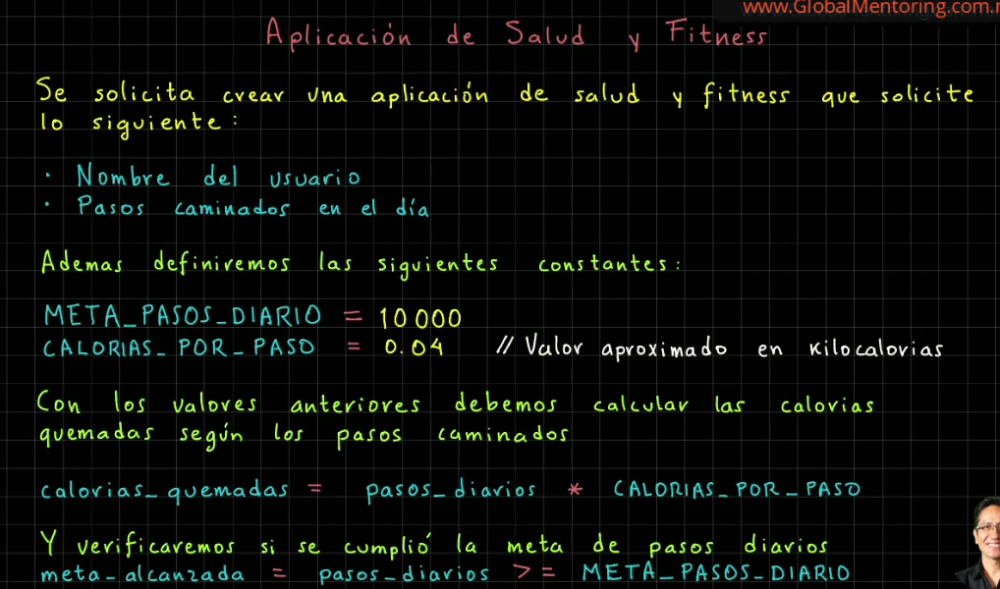
```java
import java.util.Scanner;

public class SaludYFitness {
    public static void main(String[] args) {
        System.out.println("*** Salud y Fitness ***");

        // Constantes
        final var META_PASOS_DIARIO = 10000;
        final var CALORIAS_POR_PASO = 0.04; // Valor aproximado, son kilocalorias

        // Pedimos los valores al usuario
        var consola = new Scanner(System.in);

        System.out.print("Cuál es tu nombre? ");
        var nombreUsuario = consola.nextLine();

        System.out.print("Cuántos pasos has caminado hoy? ");
        var pasosDiarios = Integer.parseInt(consola.nextLine());

        // Veirificar si el usuario alcanzó la meta de pasos diarios
        var metaAlcanzada = (pasosDiarios >= META_PASOS_DIARIO) ? "Si :)" : "No :(";

        // Calculamos las calorías quemadas
        var caloriasQuemadas = pasosDiarios * CALORIAS_POR_PASO;

        // Mostramos la información
        System.out.printf("""
                %nUsuario: %s
                Pasos dados hoy: %d
                Calorías quemadas: %.2f kcal
                Meta de pasos diario alcanzada: %s
                ----------------------------------
                La meta de pasos diarios es de: %d pasos
                """, nombreUsuario, pasosDiarios, caloriasQuemadas,
                    metaAlcanzada, META_PASOS_DIARIO);


    }
}
```

### Sistema de reserva de un hotel
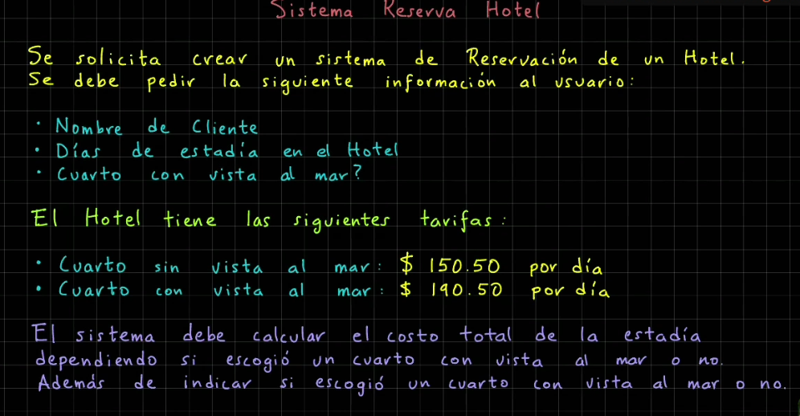
```java
import java.util.Scanner;

public class SistemaReservaHotel {
    public static void main(String[] args) {
        System.out.println("*** Sistema de Reserva de Hotel ***");

        // Variables del hotel
        final var TARIFA_DIARIA_SIN_VISTA_MAR = 150.50;
        final var TARIFA_DIARIA_CON_VISTA_MAR = 190.50;

        // Pedimos la información al cliente
        var consola = new Scanner(System.in);

        System.out.print("Nombre del Cliente: ");
        var nombreCliente = consola.nextLine();

        System.out.print("Días de estadía: ");
        var diasEstadia = Integer.parseInt(consola.nextLine());

        System.out.print("Con vista al mar (true/false)? ");
        var conVistaAlMar = Boolean.parseBoolean(consola.nextLine());

        // Cálculo de costo total de la estadía
        var costoTotal = 0.0;
        if(conVistaAlMar)
            costoTotal = diasEstadia * TARIFA_DIARIA_CON_VISTA_MAR;
        else
            costoTotal = diasEstadia * TARIFA_DIARIA_SIN_VISTA_MAR;

        // Mostramos los detalles de la reserva
        System.out.printf("""
                %n------------ Detalles de la Reservación -----------
                Cliente: %s
                Días de estadía: %d
                Costo total: $%.2f
                Habitación con vista al mar: %s
                """, nombreCliente, diasEstadia, costoTotal,
                conVistaAlMar ? "Sí :)" : "No :(");

    }
}
```

### El mayor de dos numeros
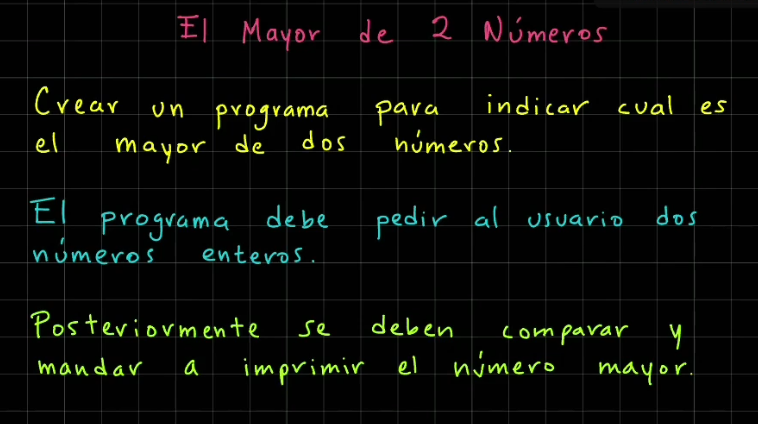
```java
import java.util.Scanner;

public class MayorDeDosNumeros {
    public static void main(String[] args) {
        System.out.println("*** El mayor de dos números ***");

        var consola = new Scanner(System.in);

        System.out.print("Proporciona el número 1: ");
        var numero1 = Integer.parseInt(consola.nextLine());

        System.out.print("Proporciona el número 2: ");
        var numero2 = Integer.parseInt(consola.nextLine());

        // El mayor de dos números
        if(numero1 > numero2)
            System.out.println("El número 1 es mayor: " + numero1);
        else
            System.out.println("El número 2 es mayor: " + numero2);
    }
}
```
### Identificar la estación del año
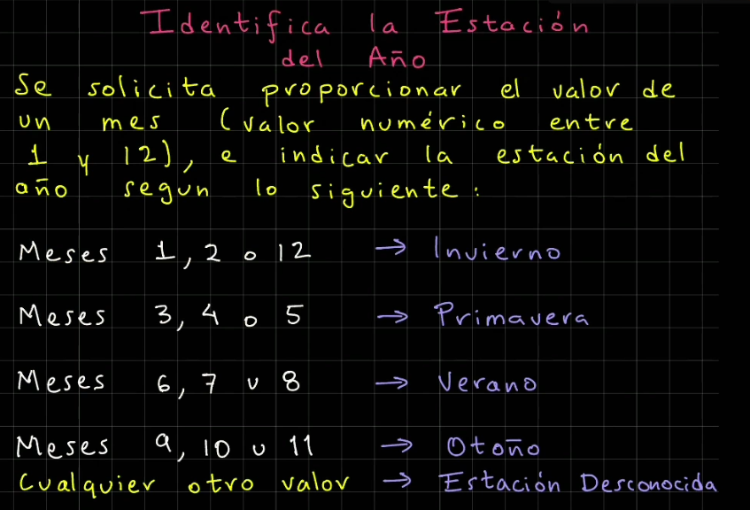
```java
import java.util.Scanner;

public class EstacionAnio {
    public static void main(String[] args) {
        System.out.println("*** Estación del Año ***");

        var consola = new Scanner(System.in);

        System.out.print("Proporciona el valor del mes (1-12): ");
        var mes = Integer.parseInt(consola.nextLine());
        var estacion = "";
        if(mes == 1 || mes == 2 || mes == 12)
            estacion = "Invierno";
        else if(mes == 3 || mes == 4 || mes == 5)
            estacion = "Primavera";
        else if(mes == 6 || mes == 7 || mes == 8)
            estacion = "Verano";
        else if(mes == 9 || mes == 10 || mes == 11)
            estacion = "Otoño";
        else
            estacion = "Estación desconcida";

        // Imprimimos el resultado
        System.out.printf("La estación para el mes %d es %s", mes, estacion);
    }
}
```
### SWITCH

### Ejemplo de Estacion del año con Switch mejorado
```java
import java.util.Scanner;

public class EstacionAnio {
    public static void main(String[] args) {
        System.out.println("*** Estación del Año ***");

        var consola = new Scanner(System.in);

        System.out.print("Proporciona el valor del mes (1-12): ");
        var mes = Integer.parseInt(consola.nextLine());

        // Revision del mes usando la sintanxis switch mejorada
        var estacion = switch(mes){
            case 1, 2, 12 -> "Invierno";
            case 3, 4, 5 -> "Primavera";
            case 6, 7, 8 -> "Verano";
            case 9, 10, 11 -> "Otoño";
            default -> "Estación desconcida";
        };

        // Imprimimos el resultado
        System.out.printf("La estación para el mes %d es %s", mes, estacion);
    }
}
```
### Ejercicio de IF ELSE

### Sistemas de calificaciones if-else


```java
import java.util.Scanner;

public class SistemaCalificaciones {
    public static void main(String[] args) {
        System.out.println("*** Sistema de Calificaciones ***");

        var consola = new Scanner(System.in);

        System.out.print("Proporciona una calificación entre 0 y 10: ");
        var calificacion = Double.parseDouble(consola.nextLine());
        var calificacionLetra = "";

        // Revisamos si está en los siguientes rangos
        if(calificacion >= 9 && calificacion <= 10)
            calificacionLetra = "A";
        else if(calificacion >= 8 && calificacion < 9)
            calificacionLetra = "B";
        else if(calificacion >= 7 && calificacion < 8)
            calificacionLetra = "C";
        else if(calificacion >= 6 && calificacion < 7)
            calificacionLetra = "D";
        else if(calificacion >=0 && calificacion < 6)
            calificacionLetra = "F";
        else
            calificacionLetra = "Calificación incorrecta";

        // Imprimimos el resultado
        System.out.printf("Calificación %.1f es equivalente a %s",
                calificacion, calificacionLetra);
    }
}
```

### Sistema de envios

```java
import java.util.Scanner;

public class SistemaEnvios {
    public static void main(String[] args) {
        System.out.println("*** Sistema de Envíos ***");

        // Definimos las tarifas de envío por kg
        final var TARIFA_NACIONAL = 10.0;
        final var TARIFA_INTERNACIONAL = 20.0;

        // Solicitamos los valores de destino y peso
        var consola = new Scanner(System.in);

        System.out.print("Ingresa el destino del paquete (nacional/internacional): ");
        var destino = consola.nextLine().strip().toLowerCase();

        System.out.print("Ingresa el peso del paquete (en kg): ");
        var peso = Double.parseDouble(consola.nextLine());

        // Calculo del envío del paquete
        Double costoEnvio = switch (destino){
            case "nacional" -> peso * TARIFA_NACIONAL;
            case "internacional" -> peso * TARIFA_INTERNACIONAL;
            default -> {
                System.out.println("Destino inválido. Ingresa nacional/internacional");
                yield null; //significa arrojar un valor
            }
        };
        // Mostramos el costo de envío
        if(costoEnvio != null)
            System.out.printf("El costo de envío de paquete es: $%.2f", costoEnvio);

    }
}
```
### Sistema de Autentificación

```java
import java.util.Scanner;

public class SistemaAutenticacion {
    public static void main(String[] args) {
        System.out.println("*** Sistema de Autenticación ***");

        final var USUARIO_VALIDO = "admin";
        final var PASSWORD_VALIDO = "123";

        var consola = new Scanner(System.in);

        System.out.print("Ingresa tu usuario: ");
        var usuario = consola.nextLine().strip();

        System.out.print("Ingresa tu password: ");
        var password = consola.nextLine().strip();

        // Cada caso de validacion de usuario y password
        var mensajeAutenticacion = switch (usuario){
            case USUARIO_VALIDO -> {
                if(PASSWORD_VALIDO.equals(password))
                    yield "Bienvenido al Sistema!";
                else
                    yield "Password incorrecto, favor de corregirlo!";
            }
            default -> {
                if(PASSWORD_VALIDO.equals(password))
                    yield "Usuario incorrecto, favor de corregirlo!";
                else
                    yield "Usuario y password incorrectos, favor de corregirlos!";
            }
        };
        // Imprimir el mensaje
        System.out.println(mensajeAutenticacion);
    }
}
```
### WHILE
```java
var contador = 1;
while(contador <= 3){
    System.out.println(contador++);
}
```
### DO-WHILE
```java
var contador = 1;
do{
    System.out.println(contador++);
}while(contador <= 3);
```

### Imprimr números impares del 0 al 20 con do-while

```java
public class NumerosImpares {
    public static void main(String[] args) {
        System.out.println("*** Números Impares ***");
        var contador = 0;
        do{
            // Revisamos si es número impar
            if(contador % 2 != 0)
                System.out.print(contador + " ");
            contador++;
        } while(contador <= 20);
    }
}
```
### FOR

### Imprimir del 0 al 20 con for
```java
public class NumeroParesFor {
    public static void main(String[] args) {
        System.out.println("*** Números Pares usando ciclo for ***");
        for(var i = 0; i <= 20; i++){
            if(i % 2 == 0)
                System.out.print(i + " ");
        }
    }
}
```
### Ejercicio acumulador suma
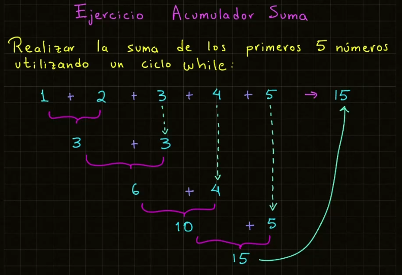
### Con ciclo for
```java
public class Ciclos {
    public static void main(String[] args) {
        // Sumar los primeros 5 numeros
        final var MAXIMO = 5;
        var acumuladorSuma = 0;

        // Iterar los valores
        for(var numero = 1; numero <= MAXIMO; numero++){
            // Imprimir lo que se va a sumar
            System.out.println("(acumuladorSuma + numero) ->" + acumuladorSuma + " + " + numero);
            acumuladorSuma += numero;
            // Imprimir el resultado parcial
            System.out.println("Suma parcial acumulada: " + acumuladorSuma);
        }
        System.out.println("Suma de los primeros 5 numeros: " + acumuladorSuma);
    }
}
```
### Con while

```java
public class SumaAcumulativa {
    public static void main(String[] args) {
        // Suma Acumulativa (Iterativa)
        final var MAXIMO = 10;
        var acumuladorSuma = 0;
        // Iterar los valores
        var numero = 1;
        while(numero <= MAXIMO){
            // Imprimir lo que se va a sumar
            System.out.println("(acumuladorSuma + numero) -> " + acumuladorSuma + " + " + numero);
            acumuladorSuma += numero++; // acumularSuma = acumuladorSuma + numero
            System.out.println("Suma parcial acumulada: " + acumuladorSuma + "\n");
        }
        System.out.println("Suma de los primeros " + MAXIMO + " números: " + acumuladorSuma);
    }
}
```
### Con do-while
```java
public class Ciclos {
    public static void main(String[] args) {
        // Sumar los primeros 5 numeros
        final var MAXIMO = 5;
        var acumuladorSuma = 0;
        var numero = 1;
        do{
            // Imprimir lo que se va a sumar
            System.out.println("(acumuladorSuma + numero) ->" + acumuladorSuma + " + " + numero);
            acumuladorSuma += numero;
            // Imprimir el resultado parcial
            System.out.println("Suma parcial acumulada: " + acumuladorSuma);
            numero++;
        } while(numero <= MAXIMO);
        System.out.println("Suma de los primeros 5 numeros: " + acumuladorSuma);
    }
}

```

### Menú iterativo 

```java
import java.util.Scanner;

public class SistemaAdministracionCuentas {
    public static void main(String[] args) {
        var consola = new Scanner(System.in);
        var salir = false;
        // Comenzar con la iteracion del menu
        while(!salir){
            System.out.print("""
                    *** Sistema de Administración de Cuentas ***
                    Menu:
                    1. Crear cuenta
                    2. Eliminar cuenta
                    3. Salir
                    Escoge una opción:\s""");
            var opcion = consola.nextInt();
            // Evaluar cada opción
            switch (opcion){
                case 1 -> System.out.println("Creando tu cuenta...\n");
                case 2 -> System.out.println("Eliminando tu cuenta...\n");
                case 3 -> {
                    System.out.println("Saliendo del sistema. Hasta pronto!");
                    salir = true;
                }
                default -> System.out.println("Opción inválida...\n");
            }
        }
        System.out.println("Fin del Sistema de Administración de Cuentas");
    }
}
```

### Cajero automatico

```java
import java.util.Scanner;

public class CajeroAutomatico {
    public static void main(String[] args) {
        var consola = new Scanner(System.in);
        var saldo = 1000.0;
        var salir = false;
        // Menu de la aplicación
        while(!salir){
            System.out.print("""
                    *** Aplicación de Cajero Automático ***
                    Operaciones que puedes realizar:
                    1. Consultar Saldo
                    2. Retirar
                    3. Depositar
                    4. Salir
                    Esocoge una opcion:\s""");
            var opcion = consola.nextInt();
            // Procesamos cada caso
            switch (opcion){
                case 1 -> System.out.printf("Tu saldo actual es: %.2f%n%n", saldo);
                case 2 -> {
                    System.out.print("Ingresa el monto a retirar: ");
                    var retiro = consola.nextDouble();
                    if(retiro <= saldo) {
                        saldo -= retiro; // saldo = saldo - retiro
                        System.out.printf("Tu nuevo saldo es: %.2f%n%n", saldo);
                    }
                    else
                        System.out.printf("No cuentas con el saldo suficiente. " +
                                "Saldo actual es: %.2f%n%n", saldo);
                }
                case 3 -> {
                    System.out.print("Ingresa el monto a depositar: ");
                    var deposito = consola.nextDouble();
                    saldo += deposito; // saldo = saldo + deposito
                    System.out.printf("Tu nuevo saldo es: %.2f%n%n", saldo);
                }
                case 4 -> {
                    System.out.println("Saliendo del Cajero Automático. Hasta pronto!");
                    salir = true;
                }
                default -> System.out.println("Opción inválida." +
                        "Seleciona otra opción.\n");
            }
        }
    }
}
```

### Aplicacion de Calculadora
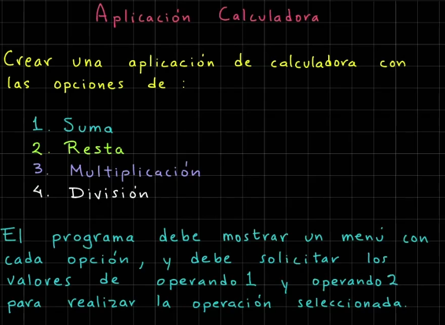
```java
import java.util.Scanner;

public class Calculadora {
    public static void main(String[] args) {
        var consola = new Scanner(System.in);
        double operando1 = 0, operando2 = 0, resultado;
        var salir = false;
        // Ciclo para la aplicacion de Calculadora
        while(!salir){
            System.out.print("""
                    *** Calculadora en Java ***
                    1. Suma
                    2. Resta
                    3. Multiplicación
                    4. División
                    5. Salir
                    Escoge una opción:\s""");
            var opcion = consola.nextInt();

            if(opcion >= 1 && opcion <= 4){
                System.out.print("Dame el valor 1: ");
                operando1 = consola.nextDouble();
                System.out.print("Dame el valor 2: ");
                operando2 = consola.nextDouble();
            }

            switch(opcion){
                case 1 -> { // Suma
                    resultado = operando1 + operando2;
                    System.out.printf("Resultado suma: %.2f%n%n", resultado);
                }
                case 2 -> { // Resta
                    resultado = operando1 - operando2;
                    System.out.printf("Resultado resta: %.2f%n%n", resultado);
                }
                case 3 -> { // Multiplicación
                    resultado = operando1 * operando2;
                    System.out.printf("Resultado multiplicación: %.2f%n%n", resultado);
                }
                case 4 -> { // División
                    if(operando2 != 0) {
                        resultado = operando1 / operando2;
                        System.out.printf("Resultado división: %.2f%n%n", resultado);
                    }
                    else
                        System.out.println("Error: División entre cero.\n");
                }
                case 5 -> { // Salir
                    System.out.println("Saliendo del programa de Calculadora!");
                    salir = true;
                }
                default -> System.out.println("Opción inválida, " +
                        "selecciona otra opción...\n");
            }
        }
    }
}
```

### Creación y validación de password

```java
import java.util.Scanner;

public class ValidacionPassword {
    public static void main(String[] args) {
        var consola = new Scanner(System.in);

        System.out.println("*** Validación de Password ***");

        System.out.print("Ingresa un password (de al menos 6 caracteres): ");
        var password = consola.nextLine();

        // Valida el password
        while (password.length() < 6){
            System.out.println("El password no cumple con los requisitos. " +
                    "Debe tener al menos 6 caracteres");
            System.out.print("Ingresa un nuevo valor de password: ");
            password = consola.nextLine();
        }
        System.out.println("El valor de password es válido: " + password);
    }
}
```

### Juego de adivinanzas
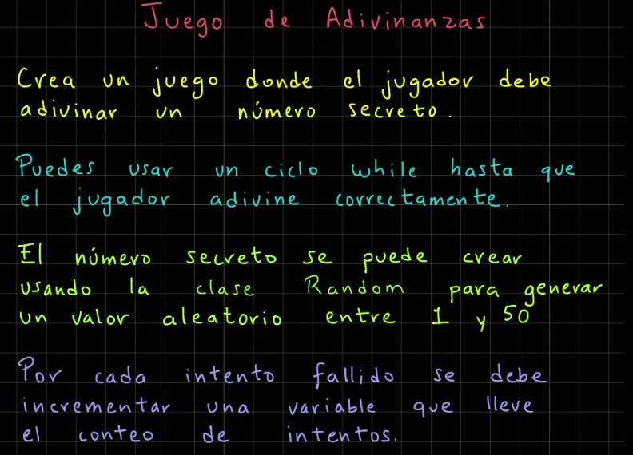
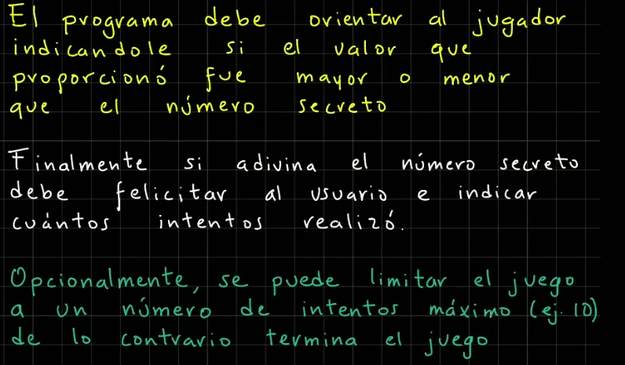
```java
import java.util.Random;
import java.util.Scanner;

public class JuegoAdivinanzas {
    public static void main(String[] args) {
        System.out.println("*** Juego de Adivinanzas ***");
        var consola = new Scanner(System.in);
        var random = new Random();

        // Generamos un número aleatorio entre 1 y 50
        var numeroSecreto = random.nextInt(50) + 1;
        var intentos = 0;
        var adivinanza = 0;
        final var INTENTOS_MAXIMOS = 5;

        while(adivinanza != numeroSecreto && intentos < INTENTOS_MAXIMOS){
            System.out.print("Adivina el número secreto (1-50): ");
            adivinanza = consola.nextInt();

            // Agregar una ayuda para orientar al jugador
            if(adivinanza < numeroSecreto)
                System.out.println("El número secreto es mayor");
            else if(adivinanza > numeroSecreto)
                System.out.println("El número secreto es menor");

            // Incrementamos la variable de intentos
            intentos++;
        }

        // Conclusión del juego
        if(adivinanza == numeroSecreto){
            System.out.printf("Felicidades, " +
                    "advinaste el número secreto en %d intentos%n", intentos);
        }
        else{
            System.out.printf("Lo siento, has agotado tus intentos máximos: %d%n",
                    INTENTOS_MAXIMOS);
            System.out.printf("El número secreto era: %d%n", numeroSecreto);
        }
    }
}
```


### Dibujar un triangulo
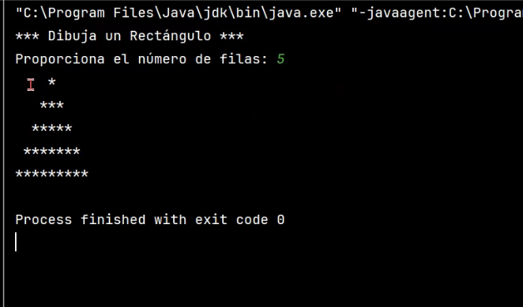
```java
import java.util.Scanner;

public class DibujaTriangulo {
    public static void main(String[] args) {
        System.out.println("*** Dibuja un Triángulo ***");
        var consola = new Scanner(System.in);
        System.out.print("Proporciona el número de filas: ");
        var numeroFilas = consola.nextInt();

        //Iteramos sobre cada fila del triángulo
        for(var fila = 1; fila <= numeroFilas; fila++){
            var espaciosBlanco = " ".repeat(numeroFilas - fila);
            var asteriscos = "*".repeat(2 * fila - 1);
            System.out.println(espaciosBlanco + asteriscos);
        }
    }
}
```

## ARREGLOS

### Promedio de calificaciones (ejercicio)

```java
import java.util.Scanner;

public class PromedioCalificaciones {
    public static void main(String[] args) {
        System.out.println("*** Promedio de Calificaciones ***");
        var consola = new Scanner(System.in);
        System.out.print("Cuantas calificaciones deseas agregar? ");
        var totalCalificaciones = Integer.parseInt(consola.nextLine());
        // Creamos el arreglo
        var calificaciones = new int[totalCalificaciones];
        // Solicitar los valores de las calificaciones
        for(var i = 0; i < totalCalificaciones; i++){
            System.out.print("Calificaciones[" + i + "] = " );
            calificaciones[i] = Integer.parseInt(consola.nextLine());
        }
        // Obtener el promedio de las calificaciones
        var sumaCalificaciones = 0;
        for(var i=0; i < totalCalificaciones; i++){
            // sumaPromedios = sumaPromedios + calificaciones[i]
            sumaCalificaciones += calificaciones[i];
        }
        var promedio = sumaCalificaciones / totalCalificaciones;
        System.out.println("\nPromedio de las Calificaciones: " + promedio);
    }
}
```
## MATRICES

### Suma diagomal de una matriz

```java
import java.util.Scanner;

public class DiagonalMatriz {
    public static void main(String[] args) {
        // Suma Diagonal de una Matriz
        int renglones, columnas;
        var consola = new Scanner(System.in);
        // Definimos la matriz
        System.out.print("Proporciona los renglones: ");
        renglones = Integer.parseInt(consola.nextLine());
        System.out.print("Proporciona las columnas: ");
        columnas = Integer.parseInt(consola.nextLine());
        var matriz = new int[renglones][columnas];
        // Solicitamos los valores
        for(var ren=0; ren < renglones; ren++){
            for(var col=0; col < columnas; col++){
                System.out.print("Valor[" + ren + "][" + col + "] = ");
                matriz[ren][col] = Integer.parseInt(consola.nextLine());
            }
        }
        // Suma de la diagonal de la matriz
        System.out.println();
        var sumaDiagonal = 0;
        for(var ren=0; ren < renglones; ren++){
            for(var col=0; col < columnas; col++){
                if(ren == col)
                    sumaDiagonal += matriz[ren][col];
            }
        }
        System.out.println("Suma Diagonal de la Matriz: " + sumaDiagonal);
    }
}

```

## FUNCIONES

### Ejemplo de Funcion sumar

```java
public class FuncionSumar {
    // Definimos la funcion sumar
    static int sumar(int a, int b){
        var resultado = a + b;
        return resultado;
    }

    public static void main(String[] args) {
        int arg1 = 3, arg2 = 8;
        var resultado_funcion = sumar(arg1, arg2);
        System.out.println("resultado_funcion = " + resultado_funcion);
        resultado_funcion = sumar(10, 20);
        System.out.println("resultado_funcion = " + resultado_funcion);
    }
}
```

### Ejemplo de funcion esPar

```java
import java.util.Scanner;

public class FuncionPar {
    // Funcion para saber si un numero es par
    static boolean esPar(int numero){
//        if(numero % 2 == 0)
//            return true;
//        else
//            return false;
        return (numero % 2 == 0) ? true : false;
    }

    public static void main(String[] args) {
        System.out.print("Proporciona un valor numérico: ");
        var numero = Integer.parseInt(new Scanner(System.in).nextLine());
        System.out.println("Número par? " + esPar(numero));
    }
}
```


### Ejemplo de funcion Recursiva

```java
public class FuncionRecursiva {
    // Imprimir 1 al 5 usando una funcion recursiva
    // Funcion recursiva
    static void funcionRecursiva(int numero){
        // Caso Base
        if(numero == 1)
            System.out.print(numero + " ");
        else{
            // Caso recursivo
            funcionRecursiva(numero - 1);
            System.out.print(numero + " ");
        }
    }

    public static void main(String[] args) {
        funcionRecursiva(10);
    }
}
```


## Operador THIS

```java
public class Aritmetica {
    int operando1;
    int operando2;

    // Constructor vacio
    public Aritmetica(){
    }

    public Aritmetica(int operando1, int operando2){
        System.out.println("Ejecutando constructor");
        this.operando1 = operando1;
        this.operando2 = operando2;
        System.out.println("Operador this: " + this);
    }

    void sumar(){
        var resultado = this.operando1 + this.operando2;
        System.out.println("Resultado Suma: " + resultado);
    }

    void restar(){
        var resultado = this.operando1 - this.operando2;
        System.out.println("Resultado Resta: " + resultado);
    }

    public static void main(String[] args) {
        System.out.println("*** Ejemplo Aritmetica ***");
        var aritmetica1 = new Aritmetica(5, 7);
        aritmetica1.sumar();
        aritmetica1.restar();
        System.out.println("Dir. Mem obj1: " + aritmetica1);
        // Creamos un segundo objeto
        System.out.println();
        var aritmetica2 = new Aritmetica(12, 16);
        aritmetica2.sumar();
        System.out.println("Dir. Memoria obj2: " + aritmetica2);
    }
}
```
