# Scanner

## Índice

- [Volver al Índice Principal](index.md)
---
- [Manejo por consola](#manejo-por-consola)
- [Leer diferentes tipos de datos](#leer-diferentes-tipos-de-datos)
- [Ejercicio: Sistema de Empleados](#ejercicio:-sistema-de-empleados)
- [Ejercicio: Reto - Proyecto Recetas de Cocina](#ejercicio:-reto---proyecto-recetas-de-cocina)
- [Números Aleatorios (Random)](#números-aleatorios-(random))
- [Formateo de Cadenas](#formateo-de-cadenas)
- [Ejercicio: Reto - Generador de ID unicor](#ejercicio:-reto---generador-de-id-unicor)
- [Ejercicio: Reto - Valor dentro de rango](#ejercicio:-reto---valor-dentro-de-rango)
- [Ejercicio: Reto - sistema descuento VIP](#ejercicio:-reto---sistema-descuento-vip)
- [Ejercicio: Reto - Sistema Prestamo Libros](#ejercicio:-reto---sistema-prestamo-libros)
- [Ejercicio: Reto - Generador ticket venta](#ejercicio:-reto---generador-ticket-venta)
- [MEJORA DEL EJERCICIO CON DESCUENTO](#mejora-del-ejercicio-con-descuento)
- [Ejercicio: Reto - Sistema de autentificacion de Usuarios](#ejercicio:-reto---sistema-de-autentificacion-de-usuarios)
- [Ejercicio: Reto - Calcular el area de un rectangulo](#ejercicio:-reto---calcular-el-area-de-un-rectangulo)


Scanner

### Manejo por consola

```java
import java.util.Scanner;

public class ManejoConsola {
    public static void main(String[] args) {
        //Introducir valores por consila
        var consola=new Scanner(System.in);
        System.out.println("escribe tu nombre");
        var nombre=consola.nextLine();
        System.out.print("nombre = " + nombre);
    }
}

```

### Leer diferentes tipos de datos
```java
import java.util.Scanner;

public class LeerTiposDatos {
    public static void main(String[] args) {
        // Leer distintos tipos de datos

        // Leer un tipo int
        var consola = new Scanner(System.in);
        System.out.print("Ingresa tu edad: ");
        var edad = consola.nextInt();
        System.out.println("edad = " + edad);

        // Leer un tipo double
        System.out.print("Ingresa tu altura: ");
        var altura = consola.nextDouble();
        System.out.println("altura = " + altura);
        // Consumimos el caracter de salto de linea
        consola.nextLine();

        /*
        Los metodos nextDouble y nextLine no consumen el caracter de salto de linea
        tenemos que consumirlos directamente nosotros antes de consumir el metodo
        nextLine(), NO ES RECOMENDABLE USARLOS  (ARRIBA)
         */


        // Leer un tipo String
        System.out.print("Ingresa tu nombre: ");
        var nombre = consola.nextLine();   //REGESA UNA CADENA
        System.out.println("nombre = " + nombre);

        // Conversion de datos
        System.out.print("Proporciona un valor entero: ");
        /*
         var enteroString = consola.nextLine();
         var entero = Integer.parseInt(enteroString);
        */
        var entero = Integer.parseInt(consola.nextLine());
        System.out.println("entero = " + entero);
        // Tipo flotante
        System.out.print("Proporciona un valor flotante: ");
        var flotante = Float.parseFloat(consola.nextLine());
        System.out.println("flotante = " + flotante);
        //Double.parseDouble()
        //Boolean.parseBoolean()
    }
}
```


### Ejercicio: Sistema de Empleados 

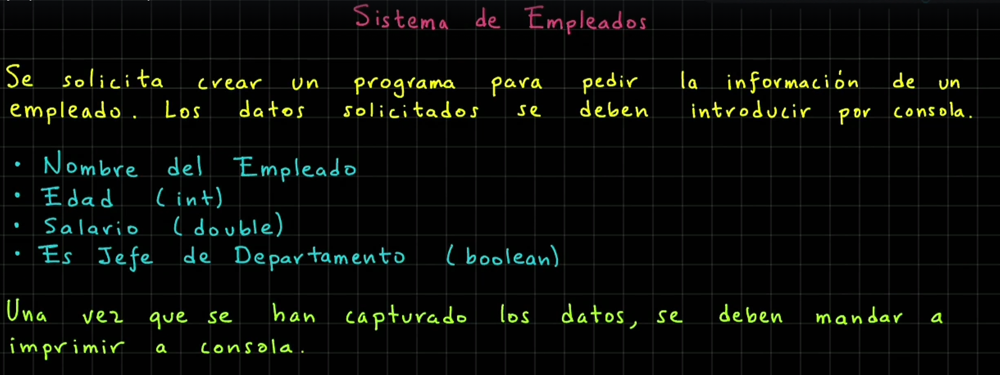

**SOLUCION AL EJERCICIO**

```java
package Java.ManejoConsola.src;

import java.util.Scanner;

public class SistemaEmpleados {
    public static void main(String[] args) {
        System.out.println("*** Sistema de empleados ***");

        var consola=new Scanner(System.in);

        //Nombre del empleado
        System.out.print("Nombre del empleado:  ");
        var nombreEmpleado=consola.nextLine();

        //Edad del empleado
        System.out.print("Edad del empleado: ");
        var edadEmpleado=Integer.parseInt(consola.nextLine());

        //Salario empleado
        System.out.print("Salario empleado: ");
        var salarioEmpleado=Double.parseDouble(consola.nextLine());

        //Es jefe de departamento
        System.out.print("Es jefe de departamenro (true/false)? ");
        var esJefeDepartamento= Boolean.parseBoolean(consola.nextLine());

        //Imprimir los valores del Empleado

        System.out.println("\nDatos del empleado: ");
        System.out.println("\tnombre: "+ nombreEmpleado);
        System.out.println("\tedad: "+edadEmpleado + "Años" );
        System.out.println("\tSalario: $%.2f".formatted(salarioEmpleado));
        System.out.println("\tEs jefe de departamento? "+ esJefeDepartamento);

    }
}
```
***
### Ejercicio: Reto - Proyecto Recetas de Cocina
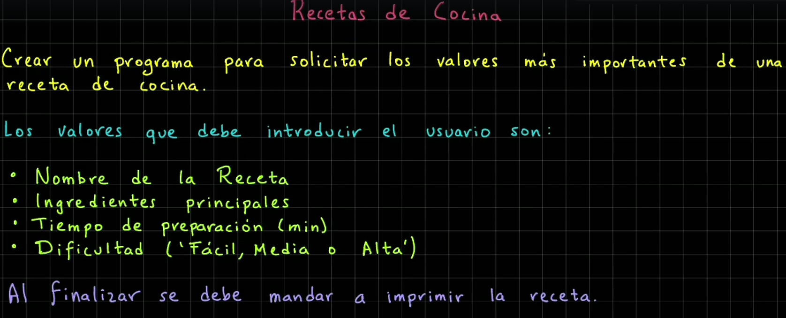
__Resultado del ejercicio__
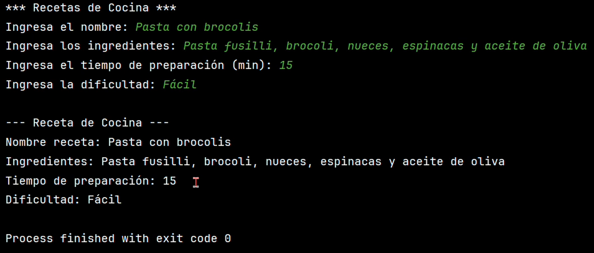

**SOLUCION AL EJERCICIO**
```java
import java.util.Scanner;

public class RecetasCocina {
    public static void main(String[] args) {
        System.out.println("*** Recetas de Cocina ***");
        var consola = new Scanner(System.in);

        // Nombre de la receta
        System.out.print("Ingresa el nombre de la receta: ");
        var nombreReceta = consola.nextLine();

        // Ingredientes
        System.out.print("Ingresa los ingredientes: ");
        var ingredientes = consola.nextLine();

        // Tiempo de preparación
        System.out.print("Ingresa el tiempo de preparación (min): ");
        var tiempoPreparacion = Integer.parseInt(consola.nextLine());

        // Dificultad de la preperación
        System.out.print("Ingresa la dificultad (Fácil/Medio/Dificil): ");
        var dificultadPreperacion = consola.nextLine();

        // Imprimir los valores de la receta
        System.out.println("\n--- Receta de Cocina ---");
        System.out.println("\tNombre receta: " + nombreReceta);
        System.out.println("\tIngredientes: " + ingredientes);
        System.out.println("\tTiempo de preparación: " + tiempoPreparacion + " minutos");
        System.out.println("\tDificultad: " + dificultadPreperacion);
    }
}

```

***
### Números Aleatorios (Random)

```java
package Java.ManejoConsola.src;

import java.util.Random;

public class NumerosAleatorios {
    public static void main(String[] args) {
        System.out.println("*** Números Aleatorios ***");
        var random = new Random();

        // Generar un numero aleatorio entre 0 y 9
        var numeroAleatorio = random.nextInt(10);
        System.out.println("numeroAleatorio entre 0 y 9 = " + numeroAleatorio);

        // Generar un numero aleatorio entre 1 y 10
        numeroAleatorio = random.nextInt(10) + 1;
        System.out.println("numeroAleatorio entre 1 y 10 = " + numeroAleatorio);

        // Generar un numero flotante entre 0.0 y 1.0
        var flotanteAleatorio = random.nextFloat();
        System.out.println("flotanteAleatorio = " + flotanteAleatorio);

        // Simular el lanzamiento de un dado (1 y 6)
        var dado = random.nextInt(6) + 1;
        System.out.println("Resultado de lanzar el dado = " + dado);
    }
}

```

### Formateo de Cadenas

```java
package Java.ManejoConsola.src;

public class FormateoCadenas {
    public static void main(String[] args) {
        System.out.println("*** Formateo de Cadenas ***");
        var nombre = "Matías";
        var edad = 35;
        var salario = 21000.50;

        // String.format
        var mensaje = String.format("Nombre: %s, Edad: %d, Salario: $%.2f",nombre, edad, salario);
        System.out.println(mensaje);

        // Metodo printf
        System.out.printf("Nombre: %s, Edad: %d, Salario: $%.2f%n", nombre, edad, salario);


        var numeroEmpleado = 12;
        // Formateo con text block
        mensaje = """
                %nDetalle Persona:\s
                -----------------
                \tNombre: %s
                \tNo. Empleado: %04d
                \tEdad: %d años
                \tSalario: $%.2f
                """.formatted(nombre, numeroEmpleado, edad, salario);
        System.out.println(mensaje);

        // Formateo con tex block y printf directamente
        System.out.printf("""
                %nDetalle Persona:\s
                -----------------
                \tNombre: %s
                \tNo. Empleado: %04d
                \tEdad: %d años
                \tSalario: $%.2f
                """, nombre, numeroEmpleado, edad, salario);
    }
}

```

### Ejercicio: Reto - Generador de ID unicor
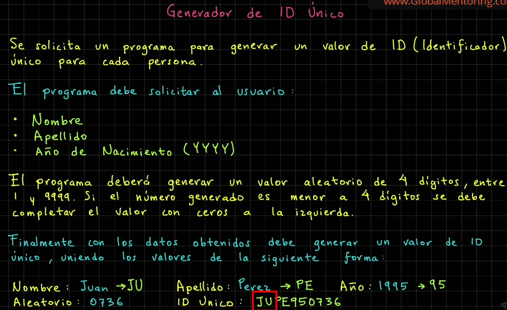
__Resultado del ejercicio__
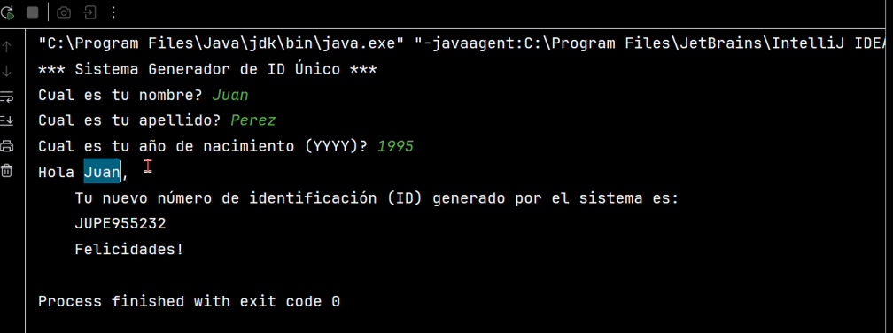

**SOLUCION AL EJERCICIO**
```java
import java.util.Random;
import java.util.Scanner;

public class GeneradorIdUnico {
    public static void main(String[] args) {
        System.out.println("*** Sistema Generador de ID Único ***");
        var consola = new Scanner(System.in);
        var aleatorio = new Random();

        // Solicitamos nombre de usuario
        System.out.print("Cual es tu nombre? ");
        var nombre = consola.nextLine();

        // Solicitamos el apellido
        System.out.print("Cual es tu apellido? ");
        var apellido = consola.nextLine();

        // Solicitamos el año de nacimiento
        System.out.print("Cual es tu año de nacimiento (YYYY)? ");
        var anioNacimiento = consola.nextLine();

        // Normalizar los valores
        var nombre2 = nombre.trim().toUpperCase().substring(0, 2);
        var apellido2 = apellido.trim().toUpperCase().substring(0,2);
        var anioNacimiento2 = anioNacimiento.trim().substring(2);

        // Generar el valor aleatorio (1 y 9999)
        var numeroAleatorio = aleatorio.nextInt(9999) + 1;

        // Formato de 4 digitos
        var numeroAleatorioFormato = String.format("%04d", numeroAleatorio);

        // Generar el ID Único
        var idUnico = nombre2 + apellido2 + anioNacimiento2 + numeroAleatorioFormato;

        // Imprimir el ID unico
        System.out.printf("""
                %nHola %s,
                \tTu nuevo número de identificación (ID) generado por el sistema es:
                \t%s
                \t¡Felicidades!
                """, nombre, idUnico);
    }
}
```


### Ejercicio: Reto - Valor dentro de rango
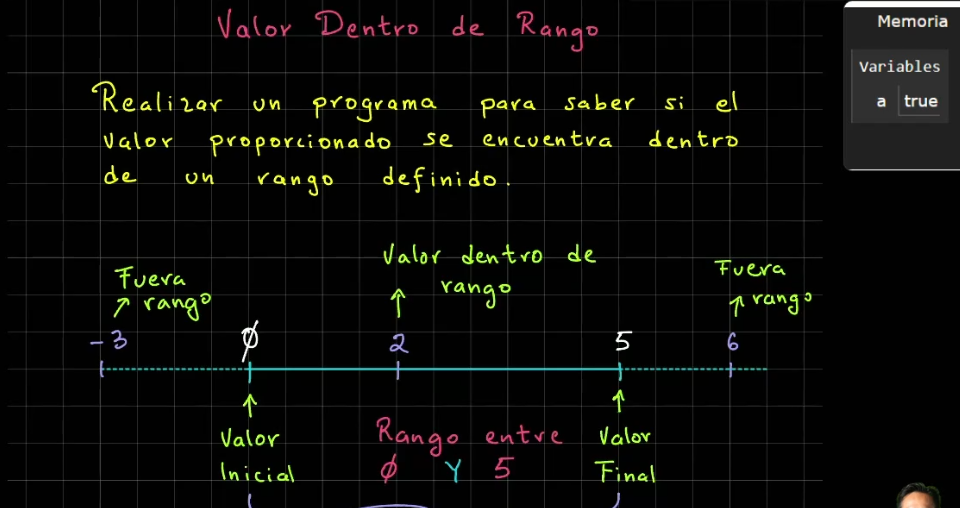

**SOLUCION AL EJERCICIO**
```java
import java.util.Scanner;

public class ValorDentroRango {
    public static void main(String[] args) {
        System.out.println("*** Valor Dentro Rango ***");
        // Definimos los limites
        final var MINIMO = 0;
        final var MAXIMO = 5;
        // Solicitar un valor entre 0 y 5
        System.out.print("Proporciona un dato entre 0 y 5: ");
        var dato = Integer.parseInt(new Scanner(System.in).nextLine());
        // Verificar si el dato esta dentro de rango
        var estaDentroRango = dato >= MINIMO && dato <= MAXIMO;
        System.out.println("estaDentroRango?  " + estaDentroRango);
    }
}
```


### Ejercicio: Reto - sistema descuento VIP
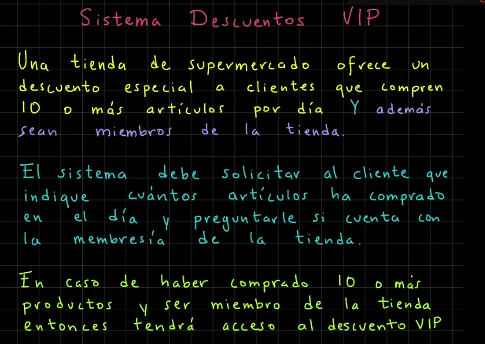

**SOLUCION AL EJERCICIO**
```java
import java.util.Scanner;

public class SistemaDescuentosVIP {
    public static void main(String[] args) {
        System.out.println("*** Sistema de Descuentos VIP*** ");
        final var NO_PRODUCTOS_DESCUENTO = 10;
        var consola = new Scanner(System.in);

        System.out.print("Cuántos productos compraste hoy? ");
        var cantidadProductos = Integer.parseInt(consola.nextLine());

        System.out.print("Tienes la membresía de la tienda (true/false)? ");
        var tienesMembresia = Boolean.parseBoolean(consola.nextLine());

        var esElegibleDescuento =
                cantidadProductos >= NO_PRODUCTOS_DESCUENTO && tienesMembresia;

        System.out.println("Tienes acceso al descuento VIP ? " + esElegibleDescuento);
    }
}
```

### Ejercicio: Reto - Sistema Prestamo Libros
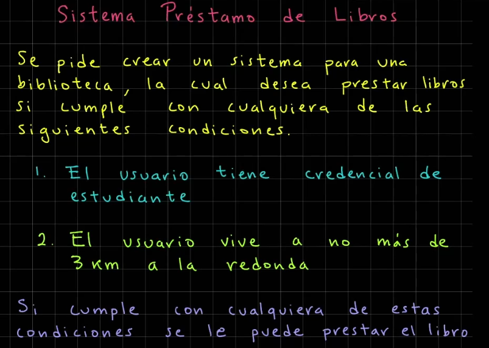

**SOLUCION AL EJERCICIO**
```java
import java.util.Scanner;

public class SistemaPrestamoLibros {
    public static void main(String[] args) {
        System.out.println("*** Sistema Prestamo Libros ***");

        final var DISTANCIA_PERMITIDA_KM = 3;
        var consola = new Scanner(System.in);

        System.out.print("Cuentas con credencial de estudiante (true/false)? ");
        var tienesCredencial = Boolean.parseBoolean(consola.nextLine());

        System.out.print("A cuanto km vives de la biblioteca? ");
        var distanciaBibliotecaKm = Integer.parseInt(consola.nextLine());

        var esElegiblePrestamo =
                tienesCredencial || distanciaBibliotecaKm <= DISTANCIA_PERMITIDA_KM;

        System.out.println("Eres elegible para prestamo de libros? " + esElegiblePrestamo);

    }
}
```


### Ejercicio: Reto - Generador ticket venta
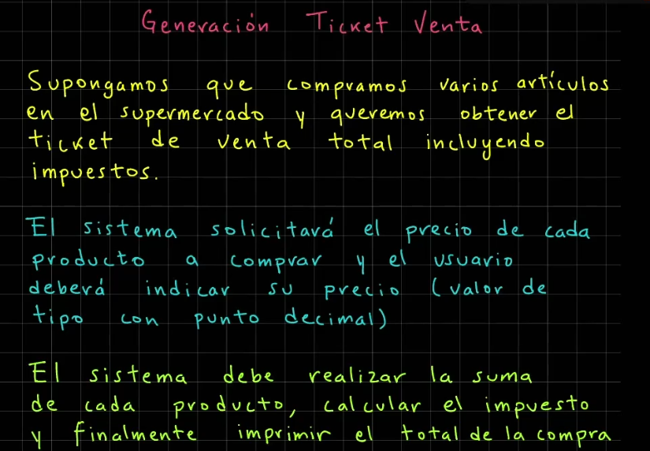

**SOLUCION AL EJERCICIO**
```java
import java.util.Scanner;

public class TicketVenta {
    public static void main(String[] args) {
        System.out.println("*** Generación Ticket de Venta ***");
        var consola = new Scanner(System.in);

        System.out.print("Precio leche: ");
        var precioLeche = Double.parseDouble(consola.nextLine());

        System.out.print("Precio pan: ");
        var precioPan = Double.parseDouble(consola.nextLine());

        System.out.print("Precio lechuga: ");
        var precioLechuga = Double.parseDouble(consola.nextLine());

        System.out.print("Precio plátanos: ");
        var precioPlatanos = Double.parseDouble(consola.nextLine());

        // Cálculo del subtotal (sin impuestos)
        var subtotal = precioLeche + precioPan + precioLechuga + precioPlatanos;

        // Cálculo con impuestos (16%)
        var impuesto = subtotal * 0.16;

        // Cálculo total de la compra (con impuestos)
        var costoTotalCompra = subtotal + impuesto;

        // Imprimir el ticket de venta
        System.out.printf("""
                %nTicket de Venta
                ---------------
                Subtotal: $%.2f
                Impuesto (16%%): $%.2f
                Costo total de la compra: $%.2f
                """, subtotal, impuesto, costoTotalCompra);
    }
}
```

### MEJORA DEL EJERCICIO CON DESCUENTO
```java
import java.util.Scanner;

public class TicketVenta {
    public static void main(String[] args) {
        System.out.println("*** Generación Ticket de Venta ***");
        var consola = new Scanner(System.in);

        System.out.print("Precio leche: ");
        var precioLeche = Double.parseDouble(consola.nextLine());

        System.out.print("Precio pan: ");
        var precioPan = Double.parseDouble(consola.nextLine());

        System.out.print("Precio lechuga: ");
        var precioLechuga = Double.parseDouble(consola.nextLine());

        System.out.print("Precio plátanos: ");
        var precioPlatanos = Double.parseDouble(consola.nextLine());

        System.out.print("Aplicar algún descuento (%)? ");
        var descuentoPorcentaje = Integer.parseInt(consola.nextLine());

        // Cálculo del subtotal (sin impuestos)
        var subtotal = precioLeche + precioPan + precioLechuga + precioPlatanos;

        // Aplicar el descuento
        var descuento = subtotal * (descuentoPorcentaje/100.0);

        // Subtotal con descuento
        var subtotalConDescuento = subtotal - descuento;

        // Cálculo con impuestos (16%)
        var impuesto = subtotalConDescuento * 0.16;

        // Cálculo total de la compra (con impuestos)
        var costoTotalCompra = subtotalConDescuento + impuesto;

        // Imprimir el ticket de venta
        System.out.printf("""
                %nTicket de Venta
                ---------------
                Subtotal: $%.2f
                Descuento: $%.2f (%d%%)
                Impuesto (16%%): $%.2f
                Costo total de la compra: $%.2f
                """, subtotal, descuento, descuentoPorcentaje,
                impuesto, costoTotalCompra);
    }
}
```
### Ejercicio: Reto - Sistema de autentificacion de Usuarios
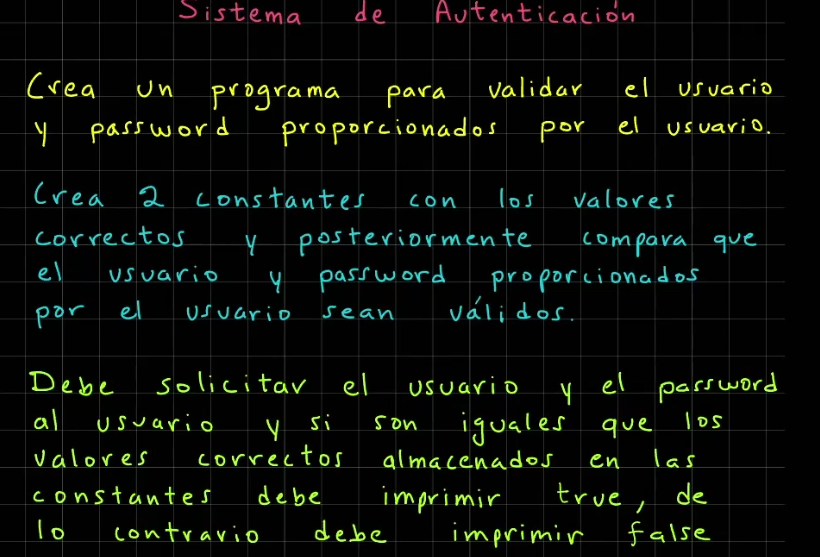

__Resultado del ejercicio__

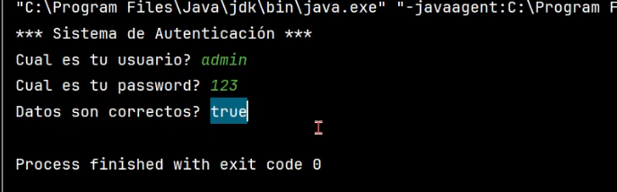

**SOLUCION AL EJERCICIO**
```java
import java.util.Scanner;

public class SistemaAutenticacion {
    public static void main(String[] args) {
        System.out.println("*** Sistema de Autenticación ***");

        final var USUARIO_VALIDO = "admin";
        final var PASSWORD_VALIDO = "123";

        var consola = new Scanner(System.in);

        System.out.print("Cuál es tu usuario? ");
        var usuarioIngresado = consola.nextLine();

        System.out.print("Cuál es tu password? ");
        var passwordIngresado = consola.nextLine();

        var sonDatosCorrectos = usuarioIngresado.equals(USUARIO_VALIDO)
                && passwordIngresado.equals(PASSWORD_VALIDO);

        System.out.println("Datos son correctos? " + sonDatosCorrectos);
    }
}
```

### Ejercicio: Reto - Calcular el area de un rectangulo
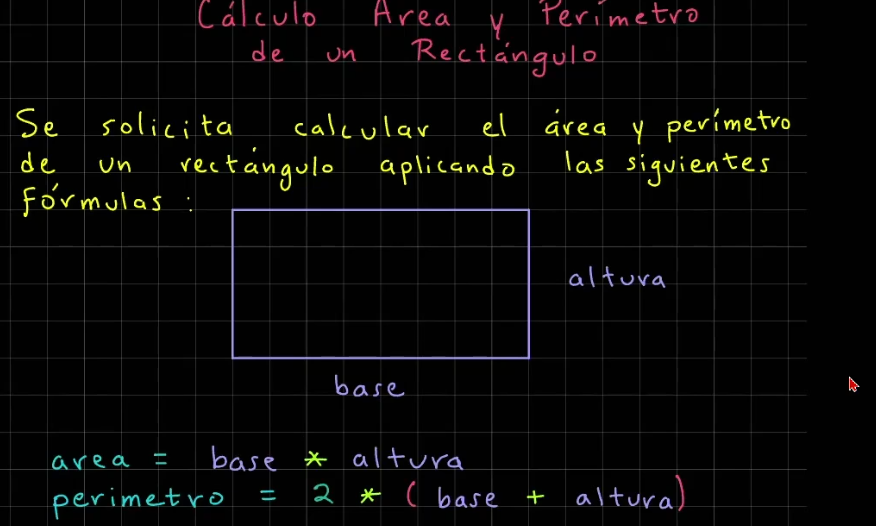


**SOLUCION AL EJERCICIO**
```java
import java.util.Scanner;

public class CalculoAreaRectangulo {
    public static void main(String[] args) {
        System.out.println("*** Cálculo del Área de un Rectángulo ***");

        var consola = new Scanner(System.in);

        System.out.print("Proporciona la base: ");
        var base = Integer.parseInt(consola.nextLine());

        System.out.print("Proporciona la altura: ");
        var altura = Integer.parseInt(consola.nextLine());

        // Realizamos el calculo del area
        var areaRectangulo = base * altura;
        System.out.println("Área del rectángulo: " + areaRectangulo);

        // Realizamos el cálculo del perímetro
        var perimetroRectangulo = (base + altura) * 2;
        System.out.println("Perímetro del rectángulo: " + perimetroRectangulo);
    }
}
```
 > **NOTA AL EDITOR: A partir de aqui el curso lo tome con el editor del README y mi cuaderno, despues del video 75 del curso y pagina 29 del cuaderno  (Universidad de Java - Cero a Experto - Actualizado (+150 hrs)). Se tomo esta desicion debido a la toma de tiempo, toma mucho tiempo pasar el codigo del editor (IntelliJ) a el redme y biseversa.**

---