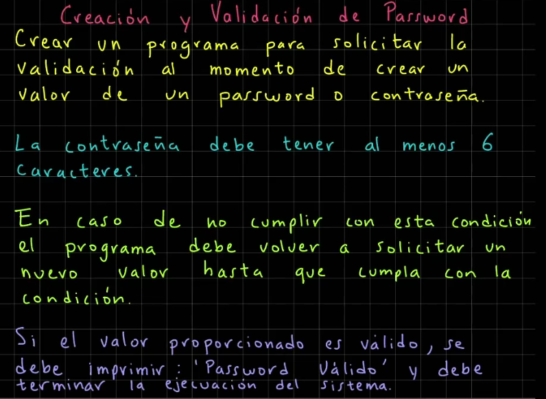

# Sentecias de desicion

## Índice

- [Volver al Índice Principal](index.md)
---
- [ELSE IF](#else-if)
- [Revisar si un numero es positivo](#revisar-si-un-numero-es-positivo)
- [Tienda en descuento](#tienda-en-descuento)
- [Sistema Bancario](#sistema-bancario)
- [Casa de los Espejos](#casa-de-los-espejos)
- [Aplicacion de Salud y Fitness](#aplicacion-de-salud-y-fitness)
- [Sistema de reserva de un hotel](#sistema-de-reserva-de-un-hotel)
- [El mayor de dos numeros](#el-mayor-de-dos-numeros)
- [Identificar la estación del año](#identificar-la-estación-del-año)
- [SWITCH](#switch)
- [Ejemplo de Estacion del año con Switch mejorado](#ejemplo-de-estacion-del-año-con-switch-mejorado)
- [Ejercicio de IF ELSE](#ejercicio-de-if-else)
- [Sistemas de calificaciones if-else](#sistemas-de-calificaciones-if-else)
- [Sistema de envios](#sistema-de-envios)
- [Sistema de Autentificación](#sistema-de-autentificación)
- [WHILE](#while)
- [DO-WHILE](#do-while)
- [Imprimr números impares del 0 al 20 con do-while](#imprimr-números-impares-del-0-al-20-con-do-while)
- [FOR](#for)
- [Imprimir del 0 al 20 con for](#imprimir-del-0-al-20-con-for)
- [Ejercicio acumulador suma](#ejercicio-acumulador-suma)
- [Con ciclo for](#con-ciclo-for)
- [Con while](#con-while)
- [Con do-while](#con-do-while)
- [Menú iterativo](#menú-iterativo)
- [Cajero automatico](#cajero-automatico)
- [Aplicacion de Calculadora](#aplicacion-de-calculadora)
- [Creación y validación de password](#creación-y-validación-de-password)
- [Juego de adivinanzas](#juego-de-adivinanzas)
- [Dibujar un triangulo](#dibujar-un-triangulo)


Sentecias de desicion

### ELSE IF
### Revisar si un numero es positivo 

```java
import java.util.Scanner;

public class ValorPositivo {
    public static void main(String[] args) {
        System.out.println("*** Valor Positivo ***");

        var consola = new Scanner(System.in);
        System.out.print("Proporciona un número: ");
        var numero = Integer.parseInt(consola.nextLine());

        if(numero > 0){
            System.out.println("Es positivo: " + numero);
        }
        else if(numero < 0){
            System.out.println("Es negativo: " + numero);
        }
        else{
            System.out.println("Es cero: " + numero);
        }
    }
}
```

### Tienda en descuento 

```java
import java.util.Scanner;

public class TiendaEnLinea {
    public static void main(String[] args) {
        System.out.println("*** Tienda en Línea con Descuentos ***");

        // Condiciones
        final var MONTO_COMPRA_DESC = 1000.00;

        var consola = new Scanner(System.in);

        System.out.print("Cual fue el monto de tu compra? ");
        var montoCompra = Double.parseDouble(consola.nextLine());

        System.out.print("Eres miembro de la tienda (true/false)? ");
        var eresMiembro = Boolean.parseBoolean(consola.nextLine());

        // Calculamos el descuento
        var descuento = 0.0;
        // Verificamos cada caso, con los datos proporcionados
        if(montoCompra >= MONTO_COMPRA_DESC && eresMiembro){
            descuento = 0.1; // Descuento del 10%
        }
        else if(eresMiembro){
            descuento = 0.05; // Descuento del 5%
        }
        else{ // No supero el monto minimo ni es miembro
            descuento = 0; // Descuento del 0%
        }

        // Hacemos los calculos respectivos para obtener el monto final
        if(descuento != 0){
            var montoDescuento = montoCompra * descuento;
            var montoFinal = montoCompra - montoDescuento;
            System.out.printf("""
                    %nFelicidades!, has obtenido un descuento del %.0f%%
                    Monto de la compra: $%.2f
                    Monto del descuento: $%.2f
                    Monto final de la compra con descuento: $%.2f%n
                    """, descuento * 100, montoCompra, montoDescuento, montoFinal);
        }
        else{
            System.out.printf("""
                    %nNo obtuviste ningún tipo de descuento.
                    Te invitamos a hacerte miembro de la tienda!
                    Monto final de la compra: $%.2f%n
                    """, montoCompra);
        }

    }
}
```

### Sistema Bancario

```java
import java.util.Scanner;

public class SistemaBancario {
    public static void main(String[] args) {
        System.out.println("*** Bienvenidos al Sistema Bancario ***");

        var consola = new Scanner(System.in);

        System.out.print("Deseas salir del sistema (true/false)? ");
        var salirSistema = Boolean.parseBoolean(consola.nextLine());

        // Veirificamos (aplicando una lógica inversa)
        if(!salirSistema){
            System.out.println("Continuamos dentro del sistema...");
        }
        else{
            System.out.println("Saliendo de sistema...");
        }

    }
}
```
### Casa de los Espejos

```java
import java.util.Scanner;

public class CasaDeLosEspejos {
    public static void main(String[] args) {
        System.out.println("*** Bienvenidos a la Casa de los Espejos ***");

        var consola = new Scanner(System.in);

        System.out.print("Cuál es tu edad? ");
        var edad = Integer.parseInt(consola.nextLine());

        System.out.print("Tienes miedo a la oscuridad (true/false)? ");
        var tienesMiedoOscuridad = Boolean.parseBoolean(consola.nextLine());

        // Verificacion
        if(!tienesMiedoOscuridad && edad >= 10){
            System.out.println("Puedes entrar a la Casa de los Espejos");
        }
        else{
            System.out.println("Lo siento, la Casa de los Espejos podría darte miedo");
        }
    }
}
```

### Aplicacion de Salud y Fitness

```java
import java.util.Scanner;

public class SaludYFitness {
    public static void main(String[] args) {
        System.out.println("*** Salud y Fitness ***");

        // Constantes
        final var META_PASOS_DIARIO = 10000;
        final var CALORIAS_POR_PASO = 0.04; // Valor aproximado, son kilocalorias

        // Pedimos los valores al usuario
        var consola = new Scanner(System.in);

        System.out.print("Cuál es tu nombre? ");
        var nombreUsuario = consola.nextLine();

        System.out.print("Cuántos pasos has caminado hoy? ");
        var pasosDiarios = Integer.parseInt(consola.nextLine());

        // Veirificar si el usuario alcanzó la meta de pasos diarios
        var metaAlcanzada = (pasosDiarios >= META_PASOS_DIARIO) ? "Si :)" : "No :(";

        // Calculamos las calorías quemadas
        var caloriasQuemadas = pasosDiarios * CALORIAS_POR_PASO;

        // Mostramos la información
        System.out.printf("""
                %nUsuario: %s
                Pasos dados hoy: %d
                Calorías quemadas: %.2f kcal
                Meta de pasos diario alcanzada: %s
                ----------------------------------
                La meta de pasos diarios es de: %d pasos
                """, nombreUsuario, pasosDiarios, caloriasQuemadas,
                    metaAlcanzada, META_PASOS_DIARIO);


    }
}
```

### Sistema de reserva de un hotel

```java
import java.util.Scanner;

public class SistemaReservaHotel {
    public static void main(String[] args) {
        System.out.println("*** Sistema de Reserva de Hotel ***");

        // Variables del hotel
        final var TARIFA_DIARIA_SIN_VISTA_MAR = 150.50;
        final var TARIFA_DIARIA_CON_VISTA_MAR = 190.50;

        // Pedimos la información al cliente
        var consola = new Scanner(System.in);

        System.out.print("Nombre del Cliente: ");
        var nombreCliente = consola.nextLine();

        System.out.print("Días de estadía: ");
        var diasEstadia = Integer.parseInt(consola.nextLine());

        System.out.print("Con vista al mar (true/false)? ");
        var conVistaAlMar = Boolean.parseBoolean(consola.nextLine());

        // Cálculo de costo total de la estadía
        var costoTotal = 0.0;
        if(conVistaAlMar)
            costoTotal = diasEstadia * TARIFA_DIARIA_CON_VISTA_MAR;
        else
            costoTotal = diasEstadia * TARIFA_DIARIA_SIN_VISTA_MAR;

        // Mostramos los detalles de la reserva
        System.out.printf("""
                %n------------ Detalles de la Reservación -----------
                Cliente: %s
                Días de estadía: %d
                Costo total: $%.2f
                Habitación con vista al mar: %s
                """, nombreCliente, diasEstadia, costoTotal,
                conVistaAlMar ? "Sí :)" : "No :(");

    }
}
```

### El mayor de dos numeros

```java
import java.util.Scanner;

public class MayorDeDosNumeros {
    public static void main(String[] args) {
        System.out.println("*** El mayor de dos números ***");

        var consola = new Scanner(System.in);

        System.out.print("Proporciona el número 1: ");
        var numero1 = Integer.parseInt(consola.nextLine());

        System.out.print("Proporciona el número 2: ");
        var numero2 = Integer.parseInt(consola.nextLine());

        // El mayor de dos números
        if(numero1 > numero2)
            System.out.println("El número 1 es mayor: " + numero1);
        else
            System.out.println("El número 2 es mayor: " + numero2);
    }
}
```
### Identificar la estación del año

```java
import java.util.Scanner;

public class EstacionAnio {
    public static void main(String[] args) {
        System.out.println("*** Estación del Año ***");

        var consola = new Scanner(System.in);

        System.out.print("Proporciona el valor del mes (1-12): ");
        var mes = Integer.parseInt(consola.nextLine());
        var estacion = "";
        if(mes == 1 || mes == 2 || mes == 12)
            estacion = "Invierno";
        else if(mes == 3 || mes == 4 || mes == 5)
            estacion = "Primavera";
        else if(mes == 6 || mes == 7 || mes == 8)
            estacion = "Verano";
        else if(mes == 9 || mes == 10 || mes == 11)
            estacion = "Otoño";
        else
            estacion = "Estación desconcida";

        // Imprimimos el resultado
        System.out.printf("La estación para el mes %d es %s", mes, estacion);
    }
}
```
### SWITCH

### Ejemplo de Estacion del año con Switch mejorado
```java
import java.util.Scanner;

public class EstacionAnio {
    public static void main(String[] args) {
        System.out.println("*** Estación del Año ***");

        var consola = new Scanner(System.in);

        System.out.print("Proporciona el valor del mes (1-12): ");
        var mes = Integer.parseInt(consola.nextLine());

        // Revision del mes usando la sintanxis switch mejorada
        var estacion = switch(mes){
            case 1, 2, 12 -> "Invierno";
            case 3, 4, 5 -> "Primavera";
            case 6, 7, 8 -> "Verano";
            case 9, 10, 11 -> "Otoño";
            default -> "Estación desconcida";
        };

        // Imprimimos el resultado
        System.out.printf("La estación para el mes %d es %s", mes, estacion);
    }
}
```
### Ejercicio de IF ELSE

### Sistemas de calificaciones if-else


```java
import java.util.Scanner;

public class SistemaCalificaciones {
    public static void main(String[] args) {
        System.out.println("*** Sistema de Calificaciones ***");

        var consola = new Scanner(System.in);

        System.out.print("Proporciona una calificación entre 0 y 10: ");
        var calificacion = Double.parseDouble(consola.nextLine());
        var calificacionLetra = "";

        // Revisamos si está en los siguientes rangos
        if(calificacion >= 9 && calificacion <= 10)
            calificacionLetra = "A";
        else if(calificacion >= 8 && calificacion < 9)
            calificacionLetra = "B";
        else if(calificacion >= 7 && calificacion < 8)
            calificacionLetra = "C";
        else if(calificacion >= 6 && calificacion < 7)
            calificacionLetra = "D";
        else if(calificacion >=0 && calificacion < 6)
            calificacionLetra = "F";
        else
            calificacionLetra = "Calificación incorrecta";

        // Imprimimos el resultado
        System.out.printf("Calificación %.1f es equivalente a %s",
                calificacion, calificacionLetra);
    }
}
```

### Sistema de envios

```java
import java.util.Scanner;

public class SistemaEnvios {
    public static void main(String[] args) {
        System.out.println("*** Sistema de Envíos ***");

        // Definimos las tarifas de envío por kg
        final var TARIFA_NACIONAL = 10.0;
        final var TARIFA_INTERNACIONAL = 20.0;

        // Solicitamos los valores de destino y peso
        var consola = new Scanner(System.in);

        System.out.print("Ingresa el destino del paquete (nacional/internacional): ");
        var destino = consola.nextLine().strip().toLowerCase();

        System.out.print("Ingresa el peso del paquete (en kg): ");
        var peso = Double.parseDouble(consola.nextLine());

        // Calculo del envío del paquete
        Double costoEnvio = switch (destino){
            case "nacional" -> peso * TARIFA_NACIONAL;
            case "internacional" -> peso * TARIFA_INTERNACIONAL;
            default -> {
                System.out.println("Destino inválido. Ingresa nacional/internacional");
                yield null; //significa arrojar un valor
            }
        };
        // Mostramos el costo de envío
        if(costoEnvio != null)
            System.out.printf("El costo de envío de paquete es: $%.2f", costoEnvio);

    }
}
```
### Sistema de Autentificación

```java
import java.util.Scanner;

public class SistemaAutenticacion {
    public static void main(String[] args) {
        System.out.println("*** Sistema de Autenticación ***");

        final var USUARIO_VALIDO = "admin";
        final var PASSWORD_VALIDO = "123";

        var consola = new Scanner(System.in);

        System.out.print("Ingresa tu usuario: ");
        var usuario = consola.nextLine().strip();

        System.out.print("Ingresa tu password: ");
        var password = consola.nextLine().strip();

        // Cada caso de validacion de usuario y password
        var mensajeAutenticacion = switch (usuario){
            case USUARIO_VALIDO -> {
                if(PASSWORD_VALIDO.equals(password))
                    yield "Bienvenido al Sistema!";
                else
                    yield "Password incorrecto, favor de corregirlo!";
            }
            default -> {
                if(PASSWORD_VALIDO.equals(password))
                    yield "Usuario incorrecto, favor de corregirlo!";
                else
                    yield "Usuario y password incorrectos, favor de corregirlos!";
            }
        };
        // Imprimir el mensaje
        System.out.println(mensajeAutenticacion);
    }
}
```
### WHILE
```java
var contador = 1;
while(contador <= 3){
    System.out.println(contador++);
}
```
### DO-WHILE
```java
var contador = 1;
do{
    System.out.println(contador++);
}while(contador <= 3);
```

### Imprimr números impares del 0 al 20 con do-while

```java
public class NumerosImpares {
    public static void main(String[] args) {
        System.out.println("*** Números Impares ***");
        var contador = 0;
        do{
            // Revisamos si es número impar
            if(contador % 2 != 0)
                System.out.print(contador + " ");
            contador++;
        } while(contador <= 20);
    }
}
```
### FOR

### Imprimir del 0 al 20 con for
```java
public class NumeroParesFor {
    public static void main(String[] args) {
        System.out.println("*** Números Pares usando ciclo for ***");
        for(var i = 0; i <= 20; i++){
            if(i % 2 == 0)
                System.out.print(i + " ");
        }
    }
}
```
### Ejercicio acumulador suma

### Con ciclo for
```java
public class Ciclos {
    public static void main(String[] args) {
        // Sumar los primeros 5 numeros
        final var MAXIMO = 5;
        var acumuladorSuma = 0;

        // Iterar los valores
        for(var numero = 1; numero <= MAXIMO; numero++){
            // Imprimir lo que se va a sumar
            System.out.println("(acumuladorSuma + numero) ->" + acumuladorSuma + " + " + numero);
            acumuladorSuma += numero;
            // Imprimir el resultado parcial
            System.out.println("Suma parcial acumulada: " + acumuladorSuma);
        }
        System.out.println("Suma de los primeros 5 numeros: " + acumuladorSuma);
    }
}
```
### Con while

```java
public class SumaAcumulativa {
    public static void main(String[] args) {
        // Suma Acumulativa (Iterativa)
        final var MAXIMO = 10;
        var acumuladorSuma = 0;
        // Iterar los valores
        var numero = 1;
        while(numero <= MAXIMO){
            // Imprimir lo que se va a sumar
            System.out.println("(acumuladorSuma + numero) -> " + acumuladorSuma + " + " + numero);
            acumuladorSuma += numero++; // acumularSuma = acumuladorSuma + numero
            System.out.println("Suma parcial acumulada: " + acumuladorSuma + "\n");
        }
        System.out.println("Suma de los primeros " + MAXIMO + " números: " + acumuladorSuma);
    }
}
```
### Con do-while
```java
public class Ciclos {
    public static void main(String[] args) {
        // Sumar los primeros 5 numeros
        final var MAXIMO = 5;
        var acumuladorSuma = 0;
        var numero = 1;
        do{
            // Imprimir lo que se va a sumar
            System.out.println("(acumuladorSuma + numero) ->" + acumuladorSuma + " + " + numero);
            acumuladorSuma += numero;
            // Imprimir el resultado parcial
            System.out.println("Suma parcial acumulada: " + acumuladorSuma);
            numero++;
        } while(numero <= MAXIMO);
        System.out.println("Suma de los primeros 5 numeros: " + acumuladorSuma);
    }
}

```

### Menú iterativo 

```java
import java.util.Scanner;

public class SistemaAdministracionCuentas {
    public static void main(String[] args) {
        var consola = new Scanner(System.in);
        var salir = false;
        // Comenzar con la iteracion del menu
        while(!salir){
            System.out.print("""
                    *** Sistema de Administración de Cuentas ***
                    Menu:
                    1. Crear cuenta
                    2. Eliminar cuenta
                    3. Salir
                    Escoge una opción:\s""");
            var opcion = consola.nextInt();
            // Evaluar cada opción
            switch (opcion){
                case 1 -> System.out.println("Creando tu cuenta...\n");
                case 2 -> System.out.println("Eliminando tu cuenta...\n");
                case 3 -> {
                    System.out.println("Saliendo del sistema. Hasta pronto!");
                    salir = true;
                }
                default -> System.out.println("Opción inválida...\n");
            }
        }
        System.out.println("Fin del Sistema de Administración de Cuentas");
    }
}
```

### Cajero automatico

```java
import java.util.Scanner;

public class CajeroAutomatico {
    public static void main(String[] args) {
        var consola = new Scanner(System.in);
        var saldo = 1000.0;
        var salir = false;
        // Menu de la aplicación
        while(!salir){
            System.out.print("""
                    *** Aplicación de Cajero Automático ***
                    Operaciones que puedes realizar:
                    1. Consultar Saldo
                    2. Retirar
                    3. Depositar
                    4. Salir
                    Esocoge una opcion:\s""");
            var opcion = consola.nextInt();
            // Procesamos cada caso
            switch (opcion){
                case 1 -> System.out.printf("Tu saldo actual es: %.2f%n%n", saldo);
                case 2 -> {
                    System.out.print("Ingresa el monto a retirar: ");
                    var retiro = consola.nextDouble();
                    if(retiro <= saldo) {
                        saldo -= retiro; // saldo = saldo - retiro
                        System.out.printf("Tu nuevo saldo es: %.2f%n%n", saldo);
                    }
                    else
                        System.out.printf("No cuentas con el saldo suficiente. " +
                                "Saldo actual es: %.2f%n%n", saldo);
                }
                case 3 -> {
                    System.out.print("Ingresa el monto a depositar: ");
                    var deposito = consola.nextDouble();
                    saldo += deposito; // saldo = saldo + deposito
                    System.out.printf("Tu nuevo saldo es: %.2f%n%n", saldo);
                }
                case 4 -> {
                    System.out.println("Saliendo del Cajero Automático. Hasta pronto!");
                    salir = true;
                }
                default -> System.out.println("Opción inválida." +
                        "Seleciona otra opción.\n");
            }
        }
    }
}
```

### Aplicacion de Calculadora

```java
import java.util.Scanner;

public class Calculadora {
    public static void main(String[] args) {
        var consola = new Scanner(System.in);
        double operando1 = 0, operando2 = 0, resultado;
        var salir = false;
        // Ciclo para la aplicacion de Calculadora
        while(!salir){
            System.out.print("""
                    *** Calculadora en Java ***
                    1. Suma
                    2. Resta
                    3. Multiplicación
                    4. División
                    5. Salir
                    Escoge una opción:\s""");
            var opcion = consola.nextInt();

            if(opcion >= 1 && opcion <= 4){
                System.out.print("Dame el valor 1: ");
                operando1 = consola.nextDouble();
                System.out.print("Dame el valor 2: ");
                operando2 = consola.nextDouble();
            }

            switch(opcion){
                case 1 -> { // Suma
                    resultado = operando1 + operando2;
                    System.out.printf("Resultado suma: %.2f%n%n", resultado);
                }
                case 2 -> { // Resta
                    resultado = operando1 - operando2;
                    System.out.printf("Resultado resta: %.2f%n%n", resultado);
                }
                case 3 -> { // Multiplicación
                    resultado = operando1 * operando2;
                    System.out.printf("Resultado multiplicación: %.2f%n%n", resultado);
                }
                case 4 -> { // División
                    if(operando2 != 0) {
                        resultado = operando1 / operando2;
                        System.out.printf("Resultado división: %.2f%n%n", resultado);
                    }
                    else
                        System.out.println("Error: División entre cero.\n");
                }
                case 5 -> { // Salir
                    System.out.println("Saliendo del programa de Calculadora!");
                    salir = true;
                }
                default -> System.out.println("Opción inválida, " +
                        "selecciona otra opción...\n");
            }
        }
    }
}
```

### Creación y validación de password

```java
import java.util.Scanner;

public class ValidacionPassword {
    public static void main(String[] args) {
        var consola = new Scanner(System.in);

        System.out.println("*** Validación de Password ***");

        System.out.print("Ingresa un password (de al menos 6 caracteres): ");
        var password = consola.nextLine();

        // Valida el password
        while (password.length() < 6){
            System.out.println("El password no cumple con los requisitos. " +
                    "Debe tener al menos 6 caracteres");
            System.out.print("Ingresa un nuevo valor de password: ");
            password = consola.nextLine();
        }
        System.out.println("El valor de password es válido: " + password);
    }
}
```

### Juego de adivinanzas


```java
import java.util.Random;
import java.util.Scanner;

public class JuegoAdivinanzas {
    public static void main(String[] args) {
        System.out.println("*** Juego de Adivinanzas ***");
        var consola = new Scanner(System.in);
        var random = new Random();

        // Generamos un número aleatorio entre 1 y 50
        var numeroSecreto = random.nextInt(50) + 1;
        var intentos = 0;
        var adivinanza = 0;
        final var INTENTOS_MAXIMOS = 5;

        while(adivinanza != numeroSecreto && intentos < INTENTOS_MAXIMOS){
            System.out.print("Adivina el número secreto (1-50): ");
            adivinanza = consola.nextInt();

            // Agregar una ayuda para orientar al jugador
            if(adivinanza < numeroSecreto)
                System.out.println("El número secreto es mayor");
            else if(adivinanza > numeroSecreto)
                System.out.println("El número secreto es menor");

            // Incrementamos la variable de intentos
            intentos++;
        }

        // Conclusión del juego
        if(adivinanza == numeroSecreto){
            System.out.printf("Felicidades, " +
                    "advinaste el número secreto en %d intentos%n", intentos);
        }
        else{
            System.out.printf("Lo siento, has agotado tus intentos máximos: %d%n",
                    INTENTOS_MAXIMOS);
            System.out.printf("El número secreto era: %d%n", numeroSecreto);
        }
    }
}
```


### Dibujar un triangulo

```java
import java.util.Scanner;

public class DibujaTriangulo {
    public static void main(String[] args) {
        System.out.println("*** Dibuja un Triángulo ***");
        var consola = new Scanner(System.in);
        System.out.print("Proporciona el número de filas: ");
        var numeroFilas = consola.nextInt();

        //Iteramos sobre cada fila del triángulo
        for(var fila = 1; fila <= numeroFilas; fila++){
            var espaciosBlanco = " ".repeat(numeroFilas - fila);
            var asteriscos = "*".repeat(2 * fila - 1);
            System.out.println(espaciosBlanco + asteriscos);
        }
    }
}
```