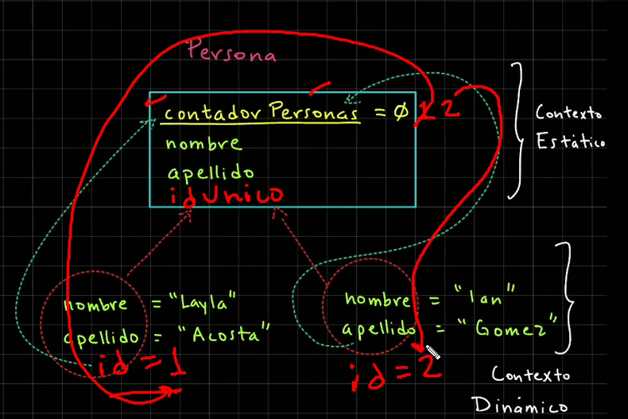
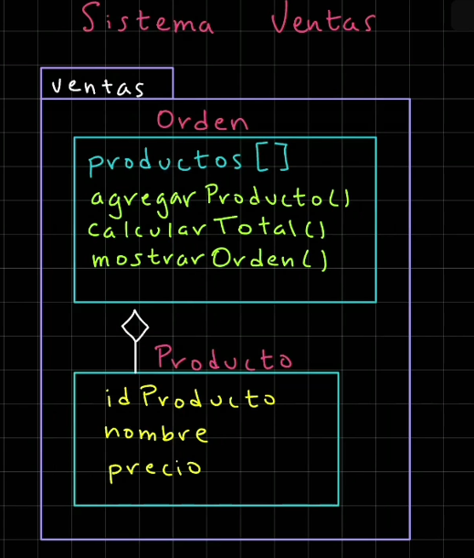
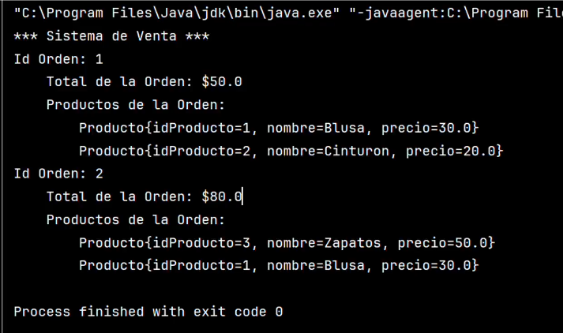

# Método toSting
## Índice
- [Volver al Índice Principal](index.md)
---
- [Demostracion del toString](#demostracion-del-método-tostring)
- [Ejemplo de Contador de Objetos Persona](#ejemplo-de-contador-de-objetos-persona)
- [Ejemplo de id Unico](#ejemplo-de-id-unico)
- [Métodos Estaticos](#métodos-estáticos)
- [Proyecto - Sistema de ventas](#proyecto---sistema-de-ventas)

### Demostracion del método toString
__Clase Persona.java__
```java
package persona;

public class Persona{
    private String nombre;
    private String apellido;

    public Persona(String nombre, String apellido){
        this.nombre = nombre;
        this.apellido = apellido;
    }

    @Override
    public String toString(){
        return "Nombre: " + this.nombre + ", Apellido: " + this.apellido
                + ", Dir. Mem. " + super.toString();
    }

    public String getNombre() {
        return this.nombre;
    }

    public void setNombre(String nombre) {
        this.nombre = nombre;
    }

    public String getApellido() {
        return this.apellido;
    }

    public void setApellido(String apellido) {
        this.apellido = apellido;
    }
}


```

__Clase PruebaPersona.java__
```java
package persona;

public class PruebaPersona {
    public static void main(String[] args) {
        System.out.println("*** Creacion de Clase y Objetos Persona ***");
        var objeto1 = new Persona("Layla", "Acosta");
        System.out.println(objeto1.toString()); // es igual que el de abajo
        System.out.println(objeto1); // automaticamente se llama toString
    }
}
```


### Ejemplo de Contador de Objetos Persona
__Clase Persona.java__
```java
package persona;

public class Persona{
    static int contadorPersonas = 0;
    private String nombre;
    private String apellido;

    public Persona(String nombre, String apellido){
        this.nombre = nombre;
        this.apellido = apellido;
        // Incrementar el atributo static
        Persona.contadorPersonas++;
    }

    @Override
    public String toString(){
        return "Nombre: " + this.nombre + ", Apellido: " + this.apellido
                + ", Dir. Mem. " + super.toString();
    }

    public String getNombre() {
        return this.nombre;
    }

    public void setNombre(String nombre) {
        this.nombre = nombre;
    }

    public String getApellido() {
        return this.apellido;
    }

    public void setApellido(String apellido) {
        this.apellido = apellido;
    }
}

```
__Clase PruebaPersona.java__
```java
package persona;

public class PruebaPersona {
    public static void main(String[] args) {
        System.out.println("*** Creacion de Clase y Objetos Persona ***");
        System.out.println("Variable estática: " + Persona.contadorPersonas);
        var objeto1 = new Persona("Layla", "Acosta");
        System.out.println(objeto1); // automaticamente se llama toString
        System.out.println("Variable estática: " + Persona.contadorPersonas);
        // Segundo objeto
        var objeto2 = new Persona("Ian", "Gomez");
        System.out.println(objeto2);
        System.out.println("Variables estática: " + Persona.contadorPersonas);
    }
}

```
### Ejemplo de id unico

__Clase Persona.java__
```java
package persona;

public class Persona{
    static int contadorPersonas = 0;
    private int idPersona;
    private String nombre;
    private String apellido;

    public Persona(String nombre, String apellido){
        this.nombre = nombre;
        this.apellido = apellido;
        // Asignamos el id unico con ayuda de la variable estatica
        this.idPersona = ++Persona.contadorPersonas;
    }

    @Override
    public String toString(){
        return "Id: " + this.idPersona
                + ", Nombre: " + this.nombre
                + ", Apellido: " + this.apellido
                + ", Dir. Mem. " + super.toString();
    }

    public int getIdPersona() {
        return this.idPersona;
    }

    public String getNombre() {
        return this.nombre;
    }

    public void setNombre(String nombre) {
        this.nombre = nombre;
    }

    public String getApellido() {
        return this.apellido;
    }

    public void setApellido(String apellido) {
        this.apellido = apellido;
    }
}

```
__Clase PruebaPersona.java__
```java
package persona;

public class PruebaPersona {
    public static void main(String[] args) {
        System.out.println("*** Creacion de Clase y Objetos Persona ***");
        System.out.println("Variable estática: " + Persona.contadorPersonas);
        var objeto1 = new Persona("Layla", "Acosta");
        System.out.println(objeto1); // automaticamente se llama toString
        System.out.println("Variable estática: " + Persona.contadorPersonas);
        // Segundo objeto
        var objeto2 = new Persona("Ian", "Gomez");
        System.out.println(objeto2);
        System.out.println("Variables estática: " + Persona.contadorPersonas);
    }
}

```


### Métodos estáticos
```java
package persona;

public class Persona{
    private static int contadorPersonas = 0;
    private int idPersona;
    private String nombre;
    private String apellido;

    public Persona(String nombre, String apellido){
        this.nombre = nombre;
        this.apellido = apellido;
        this.idPersona = ++Persona.contadorPersonas;
    }

    @Override
    public String toString(){
        return "Id: " + this.idPersona
                + ", Nombre: " + this.nombre
                + ", Apellido: " + this.apellido;
    }

    public void mostrarPersona(){
        System.out.println("Nombre: " + this.nombre);
        System.out.println("Apellido: " + this.apellido);
    }

    public String getNombre(){
        return this.nombre;
    }

    public void setNombre(String nombre){
        this.nombre = nombre;
    }

    public String getApellido() {
        return this.apellido;
    }

    public void setApellido(String apellido) {
        this.apellido = apellido;
    }

    public static int getContadorPersonas(){
        return Persona.contadorPersonas;
    }

}
```
```java
package persona;

public class PruebaPersona {
    public static void main(String[] args) {
        System.out.println("*** Creacion de Objetos de la Clase Persona ***");
        var objeto1 = new Persona("Layla", "Acosta");
        System.out.println(objeto1);//De manera automatica se llama .toString()
        var objeto2 = new Persona("Ian", "Gomez");
        System.out.println(objeto2);
        System.out.println("Valor contadorPersonas: "
                + Persona.getContadorPersonas());
    }
}

```

### Proyecto - Sistema de Ventas



__Clase Producto__
```java
package ventas;

public class Producto{
    private final int idProducto;
    private String nombre;
    private double precio;
    private static int contadorProductos;

    public Producto(String nombre, double precio){
        this.idProducto = ++Producto.contadorProductos;
        this.nombre = nombre;
        this.precio = precio;
    }

    public int getIdProducto() {
        return this.idProducto;
    }

    public String getNombre() {
        return this.nombre;
    }

    public void setNombre(String nombre) {
        this.nombre = nombre;
    }

    public double getPrecio() {
        return this.precio;
    }

    public void setPrecio(double precio) {
        this.precio = precio;
    }

    @Override
    public String toString() {
        return "Producto{" +
                "idProducto=" + this.idProducto +
                ", nombre='" + this.nombre + '\'' +
                ", precio=" + this.precio +
                '}';
    }
}
```
__Clase PruebaVenta__
```java
package ventas;

public class PruebaVentas {
    public static void main(String[] args) {
        System.out.println("*** Sistema de Ventas ***");
        var producto1 = new Producto("Blusa", 30.00);
        //System.out.println(producto1);
        var producto2 = new Producto("Zapatos", 50.00);
        //System.out.println(producto2);


        // Primer orden
        var orden1= new Orden();
        orden1.agregarProducto(producto1);
        orden1.agregarProducto(producto2);
        System.out.print(odenen1); //esto lo usamos modificando el toString
        //orden1.mostrarOrden();


        // Segundo Orden
        var orden2=new Orden();
        orden2.agregarProducto(new Producto("Playera",15));
        orden2.agregarProducto(producto1);
        orden2.agregarProducto(producto2);
        //orden2.mostrarOrden();
        System.out.print(odenen2); //esto lo usamos modificando el toString


    }
}
```
__Clase Orden__
```java
package ventas;

public class Orden {
    private final int idOrden;
    private Producto[] productos;
    private int contadorProductos;
    private static final int MAX_PRODUCTOS = 10;
    private static int contadorOrdenes;

    public Orden(){
        this.idOrden = ++Orden.contadorOrdenes;
        this.productos = new Producto[Orden.MAX_PRODUCTOS];
    }

    public void agregarProducto(Producto producto){
        if(this.contadorProductos < Orden.MAX_PRODUCTOS)
            this.productos[this.contadorProductos++] = producto;
        else
            System.out.println("Se ha superado el máximo de productos: "
                + Orden.MAX_PRODUCTOS);
    }

    public double calcularTotal(){
        double total=0;
        for (var i=0; i<this.contadorProductos; i++){
            var producto= this.productos[i];
            total+= producto.getPrecio(); //total = total + producto.getPrecio();
        }
        return total;

    }
    /*
    public void mostrarOrden(){
        System.out.println("Id Orden: "+this.idOrden);
        var totalOrden=this.calcularTotal();
        System.out.println("\tTotal de la orden: "+ totalOrden);
        System.out.println("\Productos de la orden: ");
        for(var i = 0; i < this.contadorProductos; i++)
        System.out.println("\t\t"+ this.productos[i]);
    }
    */

    @Override
    public String toSting(){
        var resultado = "Id Orden: " + this.idOrden + "\n";
        var totalOrden=this.calcularTotal();
        resultado += "\tTotal de la orden: "+ totalOrden + "\n";
        resultado += "\Productos de la orden: " + "\n";
        for(var i = 0; i < this.contadorProductos; i++)
        var resultado += "\t\t"+ this.productos[i] + "\n";
        return resultado;
    }
}

```
